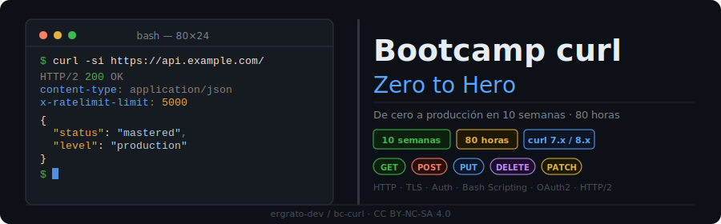

<p align="center">
  
</p>

<p align="center">
  <a href="LICENSE"></a>
  
  
  
  <a href="README.md"></a>
</p>

---

## Description

Intensive **10-week (80-hour)** bootcamp dedicated to mastering `curl` from zero to production level. Covers HTTP, authentication, scripting, OAuth2, HTTP/2, and CI/CD automation.

### Final Goal

By the end of the bootcamp you will be able to:

- Interact with any REST API from the command line
- Debug network and TLS issues without GUI tools
- Write robust bash scripts using curl
- Implement complete OAuth2 flows from the terminal
- Integrate curl in CI/CD pipelines

---

## Bootcamp Structure

| Stage | Weeks | Hours | Topics |
|-------|-------|-------|--------|
| **Fundamentals** | 1–3  | 24h | HTTP, methods, headers, JSON, basic authentication |
| **Intermediate**  | 4–6  | 24h | Files, SSL/TLS, cookies, output, debug |
| **Advanced**      | 7–9  | 24h | Bash scripting, OAuth2, HTTP/2, performance |
| **Production**    | 10   | 8h  | Final project, CI/CD, real integration |

---

## Weekly Content

| # | Week | Description |
|---|------|-------------|
| 01 | [HTTP and basic curl](bootcamp/week-01-http_y_curl_basico/) | GET, URL anatomy, HTTP responses |
| 02 | [HTTP methods, headers and JSON](bootcamp/week-02-metodos_http_headers_json/) | POST/PUT/DELETE/PATCH, headers, JSON bodies |
| 03 | [Basic authentication](bootcamp/week-03-autenticacion_basica/) | Basic Auth, API Keys, Bearer tokens |
| 04 | [Files, forms and multipart](bootcamp/week-04-archivos_formularios_multipart/) | Upload/download, form data, multipart |
| 05 | [SSL/TLS, cookies and redirects](bootcamp/week-05-ssl_tls_cookies_redirects/) | Certificates, cookies, redirects, timeouts |
| 06 | [Output, debug and configuration](bootcamp/week-06-output_debug_configuracion/) | verbose, write-out, silent, .curlrc |
| 07 | [Bash scripting with curl](bootcamp/week-07-scripting_bash_con_curl/) | Loops, error handling, jq, automation |
| 08 | [OAuth2 and advanced authentication](bootcamp/week-08-oauth2_y_autenticacion_avanzada/) | Authorization code, client credentials, JWT |
| 09 | [HTTP/2, parallelism and performance](bootcamp/week-09-http2_paralelismo_performance/) | HTTP/2, parallel, --parallel-max, WebSockets |
| 10 | [Final project](bootcamp/week-10-proyecto_final/) | Real integration, CI/CD, reusable scripts |

---

## Week Structure

```
week-XX-topic/
├── README.md                  # Goals, contents, checklist
├── rubrica-evaluacion.md      # Evaluation criteria
├── 0-assets/                  # Diagrams and visual resources
├── 1-teoria/                  # Theoretical material in markdown
├── 2-practicas/               # Guided exercises with solutions
├── 3-proyecto/                # Weekly project
│   └── starter/               # Starting point
├── 4-recursos/
│   ├── ebooks-free/
│   ├── videografia/
│   └── webgrafia/
└── 5-glosario/
    └── README.md
```

---

## Prerequisites

- Linux/macOS terminal or WSL on Windows
- `curl` 7.x or higher installed (`curl --version`)
- Basic terminal knowledge (ls, cd, cat, pipes)
- Text editor (any)

No prior programming knowledge required. Bash scripts are learned throughout the bootcamp.

---

## License

[CC BY-NC-SA 4.0](LICENSE) — Free to use for non-commercial educational purposes.
