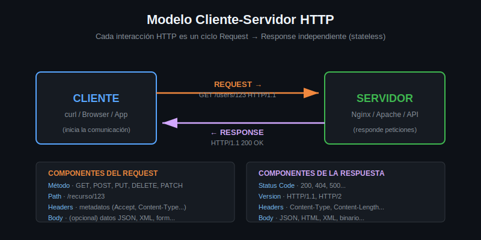

# HTTP: Qué es y cómo funciona



## El modelo cliente-servidor

HTTP (HyperText Transfer Protocol) es el protocolo de comunicación que usa la web. Funciona sobre un modelo simple:

```
Cliente                        Servidor
  |                               |
  |--- REQUEST (petición) ------->|
  |                               |  procesa
  |<-- RESPONSE (respuesta) ------|
```

**Cliente**: quien inicia la comunicación (tu terminal con curl, un browser, una app)
**Servidor**: quien responde (un servidor web, una API)

---

## El ciclo Request / Response

Cada interacción HTTP tiene dos partes:

### Request (lo que envías)

```
GET /users/123 HTTP/1.1
Host: api.ejemplo.com
Accept: application/json
```

Componentes:
- **Método** (verbo): qué quieres hacer (`GET`, `POST`, `PUT`, `DELETE`, `PATCH`)
- **Path**: dónde quieres hacerlo (`/users/123`)
- **Versión**: qué versión del protocolo (`HTTP/1.1`)
- **Headers**: metadatos de la petición
- **Body** (opcional): datos que envías (en POST, PUT, PATCH)

### Response (lo que recibes)

```
HTTP/1.1 200 OK
Content-Type: application/json
Content-Length: 47

{"id": 123, "name": "Ana", "email": "ana@x.com"}
```

Componentes:
- **Status line**: versión + código de estado + mensaje
- **Headers**: metadatos de la respuesta
- **Body**: los datos que pediste

---

## Verbos HTTP

| Verbo | Acción | Con body |
|-------|--------|----------|
| `GET` | Leer un recurso | No |
| `POST` | Crear un recurso | Sí |
| `PUT` | Reemplazar un recurso completo | Sí |
| `PATCH` | Modificar parte de un recurso | Sí |
| `DELETE` | Eliminar un recurso | No (usualmente) |
| `HEAD` | Como GET pero sin body en respuesta | No |
| `OPTIONS` | Preguntar qué métodos acepta el servidor | No |

---

## HTTP vs HTTPS

| | HTTP | HTTPS |
|-|------|-------|
| Puerto default | 80 | 443 |
| Cifrado | No | Sí (TLS) |
| Seguro | No | Sí |

HTTPS es HTTP con una capa TLS por encima. curl soporta ambos de manera transparente — solo cambia el esquema en la URL.

---

## HTTP es sin estado (stateless)

Cada request es independiente. El servidor no recuerda peticiones anteriores. Para mantener estado (sesión de usuario, carrito de compras) se usan cookies, tokens, o IDs de sesión enviados en cada request.

---

## Que hace curl en este contexto

curl es un cliente HTTP de línea de comandos. Te permite:

```bash
# Lo que haría un browser al abrir https://api.github.com/users/octocat
curl https://api.github.com/users/octocat
```

curl construye el request, lo envía al servidor, recibe la respuesta y la muestra en tu terminal. Nada más. Todo el control es tuyo.
