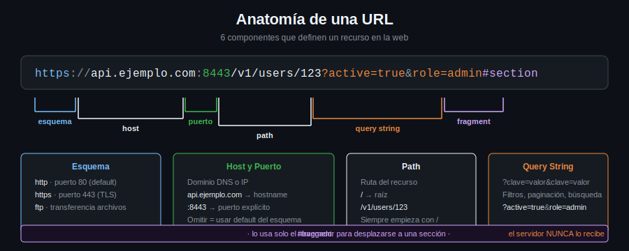

# Anatomía de una URL



Una URL (Uniform Resource Locator) tiene hasta 6 partes. Conocerlas te permite construir requests correctos con curl.

---

## Estructura completa

```
https://api.ejemplo.com:8443/v1/users/123?active=true&role=admin#section
  |          |            |    |           |                      |
esquema     host         puerto path      query string          fragment
```

---

## Cada componente

### Esquema (protocolo)

```
https://...
http://...
ftp://...
```

Le dice al cliente cómo conectarse. Para APIs web: `http` o `https`.

### Host

```
api.ejemplo.com
localhost
192.168.1.10
```

El servidor al que te conectas. Puede ser dominio o IP.

### Puerto

```
:8443
:3000
:80   (default HTTP, implícito)
:443  (default HTTPS, implícito)
```

Si omitís el puerto, curl usa el default según el esquema.

### Path

```
/v1/users/123
/api/productos
/
```

Identifica el recurso dentro del servidor. Empieza siempre con `/`.

### Query String

```
?active=true&role=admin
?search=curl&limit=10
```

Parámetros opcionales para filtrar, paginar, buscar. Empieza con `?`, pares `clave=valor` separados por `&`.

### Fragment

```
#section
#instalacion
```

Referencia a una sección del documento. **El servidor nunca lo recibe** — lo usa solo el cliente (browser). curl lo ignora.

---

## Ejemplos reales

```bash
# Solo esquema + host → path implícito es /
curl https://api.github.com

# Con path
curl https://api.github.com/users/octocat

# Con query string
curl "https://api.github.com/search/repositories?q=curl&sort=stars"

# Con puerto explícito
curl http://localhost:3000/api/health

# URL compleja — siempre entre comillas cuando tiene & o caracteres especiales
curl "https://httpbin.org/get?foo=1&bar=2"
```

---

## Regla práctica: comillas en curl

Siempre ponés la URL entre comillas dobles cuando contiene:
- `&` (query string con múltiples parámetros)
- `?` seguido de texto (en algunas shells)
- Espacios (encodear como `%20` o usar comillas)
- Caracteres especiales: `[`, `]`, `{`, `}`

```bash
# MAL: la shell interpreta & como "ejecutar en background"
curl https://httpbin.org/get?a=1&b=2

# BIEN
curl "https://httpbin.org/get?a=1&b=2"
```

---

## Encoding de URLs

Los espacios y caracteres especiales deben codificarse:

| Carácter | Encoded |
|----------|---------|
| espacio | `%20` o `+` |
| `@` | `%40` |
| `/` (en valor) | `%2F` |
| `:` (en valor) | `%3A` |

curl tiene `--data-urlencode` para hacer esto automáticamente:

```bash
curl --data-urlencode "nombre=Juan García" https://httpbin.org/post
```
