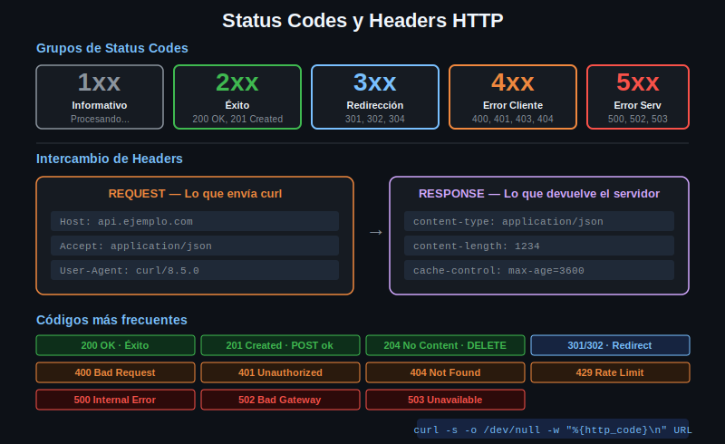

# Status Codes y Headers HTTP



## Status Codes

La primera línea de toda respuesta HTTP incluye un código de 3 dígitos que indica el resultado.

```
HTTP/1.1 200 OK
         ^^^
         status code
```

### Grupos

| Rango | Categoría | Significado |
|-------|-----------|-------------|
| 1xx | Informacional | Proceso en curso |
| 2xx | Éxito | La petición funcionó |
| 3xx | Redirección | Hay que ir a otro lugar |
| 4xx | Error del cliente | Vos hiciste algo mal |
| 5xx | Error del servidor | El servidor falló |

### Los más comunes

| Código | Nombre | Cuándo ocurre |
|--------|--------|---------------|
| 200 | OK | Éxito genérico |
| 201 | Created | Recurso creado (POST exitoso) |
| 204 | No Content | Éxito pero sin body (DELETE) |
| 301 | Moved Permanently | URL cambió para siempre |
| 302 | Found | Redirect temporal |
| 304 | Not Modified | El caché sigue siendo válido |
| 400 | Bad Request | Request mal formado |
| 401 | Unauthorized | No autenticado (falta token) |
| 403 | Forbidden | Autenticado pero sin permiso |
| 404 | Not Found | El recurso no existe |
| 405 | Method Not Allowed | Ese verbo no está permitido |
| 409 | Conflict | Conflicto con el estado actual |
| 422 | Unprocessable Entity | Datos inválidos (validación) |
| 429 | Too Many Requests | Rate limit excedido |
| 500 | Internal Server Error | El servidor explotó |
| 502 | Bad Gateway | El proxy no llegó al backend |
| 503 | Service Unavailable | Servidor temporalmente caído |

### Capturar el status code con curl

```bash
# Solo mostrar el status code
curl -s -o /dev/null -w "%{http_code}" https://httpbin.org/get
# → 200

# Con salto de línea
curl -s -o /dev/null -w "%{http_code}\n" https://httpbin.org/status/404
# → 404
```

---

## Headers HTTP

Los headers son metadatos en formato `Nombre: Valor`. Van tanto en el request como en la respuesta.

### Headers de request comunes

| Header | Ejemplo | Para qué sirve |
|--------|---------|----------------|
| `Host` | `api.ejemplo.com` | Dominio del servidor (obligatorio HTTP/1.1) |
| `Accept` | `application/json` | Formato que acepta el cliente |
| `Content-Type` | `application/json` | Formato del body que enviás |
| `Authorization` | `Bearer eyJ...` | Credenciales de autenticación |
| `User-Agent` | `curl/8.5.0` | Identificación del cliente |
| `Accept-Language` | `es-AR,es;q=0.9` | Idioma preferido |

### Headers de respuesta comunes

| Header | Ejemplo | Para qué sirve |
|--------|---------|----------------|
| `Content-Type` | `application/json; charset=utf-8` | Formato del body |
| `Content-Length` | `1234` | Tamaño en bytes |
| `Cache-Control` | `max-age=3600` | Instrucciones de caché |
| `Location` | `https://nuevo.url/` | URL de redirect |
| `X-RateLimit-Remaining` | `59` | Requests restantes |
| `Set-Cookie` | `session=abc123; HttpOnly` | Cookie a guardar |

### Leer headers con curl

```bash
# Solo headers de respuesta
curl -I https://httpbin.org/get

# Headers + body
curl -i https://httpbin.org/get

# Todo (incluyendo headers enviados)
curl -v https://httpbin.org/get
```

### Enviar headers con curl

```bash
# Un header
curl -H "Accept: application/json" https://httpbin.org/get

# Múltiples headers
curl \
  -H "Accept: application/json" \
  -H "X-App-Version: 2.1" \
  https://httpbin.org/get

# Ver qué headers enviaste (httpbin te los refleja)
curl -s https://httpbin.org/headers | python3 -m json.tool
```

---

## Content-Type: lo mas importante

`Content-Type` es el header más crítico para trabajar con APIs:

- En la **respuesta**: te dice en qué formato está el body
- En el **request**: le dice al servidor en qué formato le mandás datos

```bash
# Le decís al servidor que le mandás JSON
curl -X POST \
  -H "Content-Type: application/json" \
  -d '{"nombre": "Ana"}' \
  https://httpbin.org/post
```

Sin `Content-Type` correcto, muchos servidores rechazan el request o lo parsean mal.
