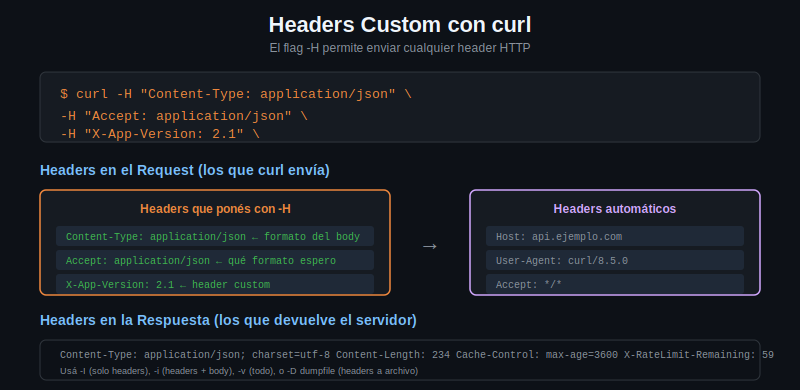

# Headers custom con curl



## Qué es un header HTTP

Los headers son metadatos del request o la respuesta. Van antes del body, separados por una línea en blanco. Le dicen al servidor (o al cliente) cosas como: en qué formato vienen los datos, qué formatos acepta el cliente, quién está haciendo el request, si hay autenticación, etc.

---

## Flag -H para setear headers

`-H` (o `--header`) agrega o sobreescribe un header en el request:

```bash
curl -H "Content-Type: application/json" https://httpbin.org/get
curl -H "Accept: application/json" https://httpbin.org/get

# Múltiples headers: un -H por header
curl -H "Content-Type: application/json" \
     -H "Accept: application/json" \
     -H "X-Request-ID: abc-123" \
     https://httpbin.org/get
```

---

## Headers más comunes

### Content-Type

Indica el formato del body que enviás:

```bash
curl -H "Content-Type: application/json" -d '{"key": "value"}' https://httpbin.org/post
curl -H "Content-Type: text/plain" -d "texto plano" https://httpbin.org/post
```

### Accept

Le dice al servidor qué formato aceptás en la respuesta:

```bash
# Pedir JSON explícitamente
curl -H "Accept: application/json" https://httpbin.org/get

# Pedir XML (si el servidor lo soporta)
curl -H "Accept: application/xml" https://httpbin.org/xml
```

### User-Agent

Identifica al cliente que hace el request. curl usa `curl/X.Y.Z` por defecto:

```bash
# Ver el User-Agent por defecto
curl -s https://httpbin.org/get | python3 -m json.tool | grep -A1 "User-Agent"

# Cambiar el User-Agent (útil para simular browsers o apps)
curl -H "User-Agent: MiApp/2.0 (Linux)" https://httpbin.org/get
```

También podés usar el flag dedicado `-A`:

```bash
curl -A "MiApp/2.0" https://httpbin.org/get
```

### Headers de autorización (preview, profundizamos en semana 3)

```bash
curl -H "Authorization: Bearer mi-token-aqui" https://httpbin.org/bearer
curl -H "X-API-Key: mi-api-key" https://httpbin.org/get
```

---

## Headers custom (X-*)

Los headers que empiezan con `X-` son custom, no forman parte del estándar HTTP. Las APIs los usan para funcionalidades específicas:

```bash
# ID de trazabilidad para logs
curl -H "X-Request-ID: 550e8400-e29b-41d4-a716-446655440000" https://httpbin.org/get

# Header custom de negocio
curl -H "X-Tenant-ID: empresa-acme" https://httpbin.org/get

# Versión de API en header (alternativa al path /v1/...)
curl -H "X-API-Version: 2024-01-01" https://httpbin.org/get
```

httpbin.org refleja todos los headers que recibe en el campo `headers` del response.

---

## Ver qué headers envía curl con -v

El flag `-v` muestra la conversación HTTP completa. Las líneas con `>` son los headers que curl envía:

```bash
curl -v -H "Content-Type: application/json" https://httpbin.org/get 2>&1 | grep "^>"
```

Salida:
```
> GET /get HTTP/2
> Host: httpbin.org
> User-Agent: curl/8.5.0
> Accept: */*
> Content-Type: application/json
```

---

## Modificar y eliminar headers que curl agrega por defecto

curl agrega automáticamente algunos headers. Podés sobreescribirlos:

```bash
# Cambiar el User-Agent
curl -H "User-Agent: mi-app/1.0" https://httpbin.org/get

# Eliminar un header (valor vacío)
curl -H "Accept:" https://httpbin.org/get

# Sobreescribir Host (útil en pruebas de proxy)
curl -H "Host: otro-dominio.com" https://httpbin.org/get
```

---

## Leer headers de la respuesta

```bash
# Solo headers de respuesta (-I hace HEAD request)
curl -I https://httpbin.org/get

# Headers de respuesta + body (sin HEAD)
curl -i https://httpbin.org/get

# Guardar headers en un archivo
curl -D headers.txt https://httpbin.org/get -o /dev/null
```

---

## Experimento con httpbin

httpbin tiene un endpoint que refleja exactamente los headers recibidos:

```bash
curl -s \
     -H "X-Mi-Header: valor-custom" \
     -H "User-Agent: bootcamp-curl/1.0" \
     -H "Accept: application/json" \
     https://httpbin.org/headers | python3 -m json.tool
```

Respuesta:
```json
{
  "headers": {
    "Accept": "application/json",
    "Host": "httpbin.org",
    "User-Agent": "bootcamp-curl/1.0",
    "X-Mi-Header": "valor-custom"
  }
}
```

Todo lo que pusiste con `-H` aparece en el response — una forma perfecta de verificar que tus headers llegan al servidor como esperás.
