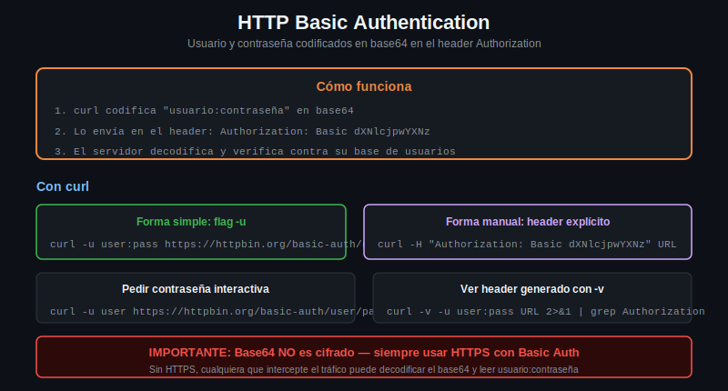

# HTTP Basic Authentication



## Cómo funciona

Basic Auth envía las credenciales en el header `Authorization`. El formato es:

```
Authorization: Basic <base64(usuario:contraseña)>
```

El string `usuario:contraseña` se codifica en base64 (no se encripta — solo se codifica). Por eso Basic Auth requiere HTTPS: si la conexión no es cifrada, cualquiera que intercepte el request puede decodificar las credenciales trivialmente.

---

## Flag -u en curl

curl tiene soporte nativo para Basic Auth con el flag `-u` (o `--user`):

```bash
curl -u user:pass https://httpbin.org/basic-auth/user/pass
```

curl convierte `user:pass` al formato `Authorization: Basic dXNlcjpwYXNz` automáticamente.

Si el login es correcto, httpbin responde:
```json
{
  "authenticated": true,
  "user": "user"
}
```

---

## Ver el header generado con -v

Para entender qué envía curl internamente:

```bash
curl -v -u user:pass https://httpbin.org/basic-auth/user/pass 2>&1 | grep -E "Authorization|< HTTP"
```

Salida:
```
> Authorization: Basic dXNlcjpwYXNz
< HTTP/2 200
```

El string `dXNlcjpwYXNz` es `user:pass` en base64. Podés verificarlo:

```bash
echo -n "user:pass" | base64
# dXNlcjpwYXNz

# Decodificar para verificar
echo "dXNlcjpwYXNz" | base64 -d
# user:pass
```

---

## Construir el header manualmente (sin -u)

Esto es útil para entender qué pasa por debajo:

```bash
# Generar el valor base64
CREDENTIALS=$(echo -n "user:pass" | base64)

# Usarlo en el header
curl -H "Authorization: Basic ${CREDENTIALS}" \
     https://httpbin.org/basic-auth/user/pass
```

El resultado es idéntico a usar `-u user:pass`.

---

## Contraseña interactiva (sin exponer en la terminal)

Si no querés que la contraseña quede en el historial del shell:

```bash
# Solo usuario: curl pide la contraseña interactivamente
curl -u user https://httpbin.org/basic-auth/user/pass
Enter host password for user 'user':
```

---

## Qué pasa con credenciales incorrectas

```bash
# Credenciales incorrectas
curl -v -u user:password-malo https://httpbin.org/basic-auth/user/pass 2>&1 | grep "< HTTP"
# < HTTP/2 401

# Sin credenciales
curl -v https://httpbin.org/basic-auth/user/pass 2>&1 | grep "< HTTP"
# < HTTP/2 401
```

El servidor puede además incluir el header `WWW-Authenticate` en el 401 para indicar qué tipo de autenticación espera:

```bash
curl -v https://httpbin.org/basic-auth/user/pass 2>&1 | grep -i "www-authenticate"
# < www-authenticate: Basic realm="Fake Realm"
```

---

## Por qué SIEMPRE requiere HTTPS

base64 no es cifrado. Decodificar `dXNlcjpwYXNz` toma medio segundo. Si la conexión va por HTTP (sin TLS), cualquier nodo intermedio (ISP, router de café, proxy corporativo) puede ver el header `Authorization` y decodificar las credenciales.

Con HTTPS, el header viaja dentro del canal TLS cifrado — nadie puede leerlo sin la clave privada del servidor.

```bash
# Nunca hacer Basic Auth sobre HTTP
curl -u user:pass http://api-sin-https.com/endpoint  # INSEGURO

# Siempre sobre HTTPS
curl -u user:pass https://api-segura.com/endpoint    # CORRECTO
```

---

## Cuándo usar Basic Auth

- APIs internas entre servicios (servidor a servidor)
- Herramientas de desarrollo y CI/CD
- Prototipos y pruebas
- Cuando la simplicidad es prioritaria y el canal está cifrado

No usar Basic Auth para:
- Aplicaciones con muchos usuarios (el servidor tiene que validar las credenciales en cada request)
- APIs públicas con rate limiting por usuario
- Sistemas donde necesitás revocar acceso por sesión (Basic Auth no tiene concepto de sesión)
