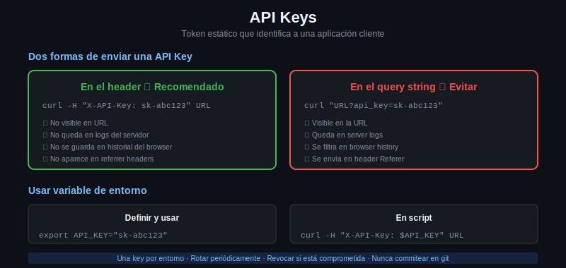

# API Keys



## Qué es una API Key

Una API Key es un string único generado por el servicio que identifica a quien hace el request. No representa un usuario humano sino a una aplicación o cliente.

Ejemplos de API Keys reales:
```
sk-proj-abc123def456...    (OpenAI)
AIzaSyD-9tSrke72...        (Google)
pk_live_51J4...            (Stripe)
```

El servicio genera la key, vos la guardás, y la incluís en cada request.

---

## Dos formas de enviar una API Key

### 1. En el header (recomendado)

La forma más común y segura. El nombre del header varía según la API:

```bash
# Header X-API-Key (convención común)
curl -H "X-API-Key: mi-api-key-aqui" https://api.ejemplo.com/datos

# Header Authorization con esquema custom
curl -H "Authorization: ApiKey mi-api-key-aqui" https://api.ejemplo.com/datos

# Algunas APIs usan su propio nombre
curl -H "X-Auth-Token: mi-api-key-aqui" https://api.ejemplo.com/datos
```

### 2. En la query string (evitar en producción)

```bash
curl "https://api.ejemplo.com/datos?api_key=mi-api-key-aqui"
```

Esta forma funciona pero tiene un problema grave: la URL completa (incluyendo la query string) queda en:
- Logs del servidor web
- Historial del browser
- Logs de proxy
- Analytics y herramientas de monitoreo

Si alguien tiene acceso a esos logs, tiene tu API Key. Por eso **el header siempre es preferible**.

---

## Ejemplo con una API real: wttr.in

wttr.in es un servicio de clima accesible por HTTP sin API Key (ideal para practicar):

```bash
# Clima de Buenos Aires en formato JSON
curl -s "https://wttr.in/Buenos+Aires?format=j1" | python3 -m json.tool | head -20

# Formato compacto
curl -s "https://wttr.in/Buenos+Aires?format=3"
# Buenos Aires: ⛅ +18°C

# Formato personalizado
curl -s "https://wttr.in/Buenos+Aires?format=%t+%C"
# +18°C Partly cloudy
```

---

## Guardar la API Key en una variable de entorno

Nunca escribas la API Key directamente en el comando:

```bash
# MAL: queda en el historial del shell
curl -H "X-API-Key: sk-mi-key-secreta" https://api.ejemplo.com/datos

# BIEN: usar variable de entorno
export API_KEY="sk-mi-key-secreta"
curl -H "X-API-Key: $API_KEY" https://api.ejemplo.com/datos
```

En scripts, leer la variable al inicio:

```bash
#!/bin/bash

if [ -z "$API_KEY" ]; then
    echo "Error: la variable API_KEY no está definida"
    echo "Usá: export API_KEY=tu-key-aqui"
    exit 1
fi

curl -s -H "X-API-Key: $API_KEY" https://api.ejemplo.com/datos
```

---

## Ejemplo completo con httpbin (simulación)

httpbin refleja los headers que recibe, lo que permite verificar que la API Key llegó correctamente:

```bash
export MI_API_KEY="clave-de-prueba-123"

curl -s \
     -H "X-API-Key: $MI_API_KEY" \
     -H "Accept: application/json" \
     https://httpbin.org/headers | python3 -m json.tool
```

Respuesta:
```json
{
  "headers": {
    "Accept": "application/json",
    "Host": "httpbin.org",
    "X-Api-Key": "clave-de-prueba-123"
  }
}
```

---

## Diferencia entre API Key y contraseña

| | API Key | Contraseña |
|-|---------|-----------|
| Representa | Una aplicación | Un usuario |
| Generada por | El servicio | El usuario |
| Se puede revocar | Sí, individualmente | Sólo cambiándola |
| Se puede tener múltiples | Sí (una por app) | No |
| Tiene expiración | Opcional | No (salvo forzada) |

---

## Buenas prácticas con API Keys

1. Una key por entorno (desarrollo, staging, producción)
2. Una key por aplicación o servicio que la usa
3. Rotar las keys periódicamente (cambiarlas por nuevas)
4. Revocar inmediatamente si sospechabas exposición
5. Nunca commitear en git — usar `.gitignore` y variables de entorno
6. Siempre en headers, nunca en query strings en producción
