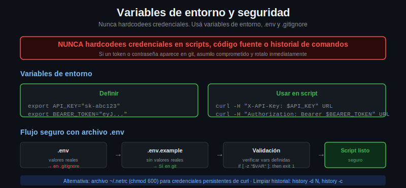

# Variables de entorno y seguridad de credenciales



## La regla más importante

**Nunca hardcodees credenciales en un script, en código fuente, o en la línea de comandos si vas a guardar el historial.**

Cuando hardcodeás una API Key en un script y ese script llega a git, la key está comprometida para siempre — incluso si la eliminás en un commit posterior, queda en el historial.

---

## Variables de entorno: la solución

Las variables de entorno viven en el proceso del shell, no en archivos de código:

```bash
# Definir en el shell actual
export API_KEY="sk-mi-clave-secreta"
export API_SECRET="secreto-de-autenticacion"

# Usar en curl
curl -H "X-API-Key: $API_KEY" https://api.ejemplo.com/datos

# Verificar que está definida (sin imprimir el valor completo)
echo "API_KEY definida: ${API_KEY:0:4}****"
```

La variable existe solo en la sesión del shell actual. No aparece en archivos y no se commitea a git.

---

## Archivo .env para proyectos

Para no tener que exportar manualmente en cada sesión:

```bash
# Crear el archivo .env
cat > .env <<'EOF'
API_KEY=sk-mi-clave-secreta
API_SECRET=secreto-de-autenticacion
BASE_URL=https://api.ejemplo.com
EOF

# Cargarlo en el shell actual
source .env

# Verificar
echo "Key cargada: ${API_KEY:0:4}****"
```

**Crítico: agregar .env al .gitignore inmediatamente:**

```bash
echo ".env" >> .gitignore
echo ".env.local" >> .gitignore
echo "*.env" >> .gitignore
```

Nunca commitees el `.env`. Sí commitear un `.env.example` con los nombres de las variables pero sin valores:

```bash
# .env.example (esto SÍ va en git)
cat > .env.example <<'EOF'
API_KEY=
API_SECRET=
BASE_URL=https://api.ejemplo.com
EOF
```

---

## Verificar que la variable está definida en scripts

```bash
#!/bin/bash

# Verificar variables requeridas al inicio del script
if [ -z "$API_KEY" ]; then
    echo "Error: API_KEY no está definida"
    echo "Ejecuta: export API_KEY=tu-key  o  source .env"
    exit 1
fi

if [ -z "$API_SECRET" ]; then
    echo "Error: API_SECRET no está definida"
    exit 1
fi

echo "Credenciales OK. Ejecutando request..."
curl -s -H "X-API-Key: $API_KEY" https://api.ejemplo.com/datos
```

---

## Limpiar el historial del shell

Si accidentalmente ejecutaste un comando con la credencial expuesta:

```bash
# Ver el historial reciente
history | tail -10

# Borrar una entrada específica del historial (número de línea)
history -d 42

# Borrar todo el historial de la sesión actual
history -c

# En zsh, limpiar historial guardado en archivo
> ~/.zsh_history

# En bash
> ~/.bash_history
```

---

## Archivo .netrc: credenciales permanentes para curl

curl soporta un archivo `.netrc` en tu home para guardar credenciales por host:

```bash
# ~/.netrc
cat > ~/.netrc <<'EOF'
machine httpbin.org
  login user
  password pass

machine api.ejemplo.com
  login mi-usuario
  password mi-contraseña
EOF

# Permisos: solo el owner puede leer
chmod 600 ~/.netrc

# Usar con curl: lee automáticamente el .netrc
curl --netrc https://httpbin.org/basic-auth/user/pass
```

`.netrc` es bueno para uso personal en la terminal. Para scripts y CI/CD, las variables de entorno son preferibles porque son más explícitas y fáciles de auditar.

---

## Resumen: buenas prácticas

| Practica | Por qué |
|----------|---------|
| Usar variables de entorno | No quedan en el código fuente |
| Archivo `.env` + `.gitignore` | Persisten en el proyecto sin llegar a git |
| `.env.example` en git | Documenta qué variables se necesitan |
| Verificar variables al inicio del script | Falla rápido con mensaje claro |
| `history -d` si se expone una credencial | Limitar la ventana de exposición |
| `chmod 600 ~/.netrc` | Solo el owner puede leerlo |
| Rotar keys comprometidas inmediatamente | Una key expuesta en git hay que revocarla |

---

## Lo que nunca hay que hacer

```bash
# MAL: credencial hardcodeada en script
curl -u admin:password123 https://api.empresa.com/admin

# MAL: API key en query string (queda en logs)
curl "https://api.ejemplo.com/datos?api_key=sk-secreto"

# MAL: commitear .env o scripts con credenciales
git add .env && git commit -m "add config"

# BIEN
export API_KEY="$(cat ~/.secrets/api-key)"
curl -H "X-API-Key: $API_KEY" https://api.ejemplo.com/datos
```
