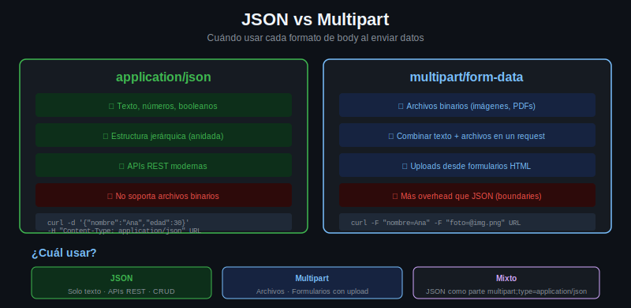

# JSON vs Multipart: cuándo usar cada formato



## El problema central

Cuando necesitás enviar datos a una API tenés principalmente dos opciones para el body:

1. JSON (`application/json`)
2. Multipart form-data (`multipart/form-data`)

La elección depende de qué tipo de datos estás enviando y qué acepta la API.

---

## Cuándo usar JSON

Usá JSON cuando:

- Todos los datos son texto o números
- La estructura es jerárquica (objetos anidados, arrays)
- La API es REST moderna y lo especifica en su documentación
- No hay archivos binarios en el request

```bash
# Crear usuario: solo texto → JSON es perfecto
curl -H "Content-Type: application/json" \
     -d '{"nombre": "Ana", "email": "ana@ejemplo.com", "rol": "admin"}' \
     https://api.ejemplo.com/usuarios

# Actualizar configuración con estructura anidada → JSON necesario
curl -H "Content-Type: application/json" \
     -d '{"config": {"theme": "dark", "lang": "es", "notifications": true}}' \
     -X PUT https://api.ejemplo.com/settings
```

---

## Cuándo usar multipart

Usá multipart cuando:

- Hay archivos binarios (imágenes, PDFs, audio, video)
- La API acepta uploads de archivos
- Necesitás combinar archivos con metadata en un mismo request

```bash
# Subir foto de perfil → requiere multipart
curl -F "foto=@perfil.jpg" \
     -F "usuario_id=123" \
     https://api.ejemplo.com/fotos

# Subir documento PDF → multipart
curl -F "documento=@informe.pdf;type=application/pdf" \
     https://api.ejemplo.com/documentos
```

---

## Por qué no se puede enviar archivos binarios en JSON directamente

JSON es texto puro. Un archivo binario como una imagen JPG contiene bytes que no son caracteres UTF-8 válidos y no pueden representarse directamente en JSON.

La alternativa existe: codificar el archivo en Base64 y enviarlo como string. Pero tiene desventajas importantes:

- Base64 aumenta el tamaño del archivo un 33%
- El servidor tiene que decodificarlo
- No es el estándar para APIs de archivos

```bash
# Base64: posible pero poco recomendado para archivos grandes
BASE64=$(base64 -w 0 imagen.jpg)
curl -H "Content-Type: application/json" \
     -d "{\"imagen_base64\": \"${BASE64}\"}" \
     https://api.ejemplo.com/fotos

# Multipart: la forma correcta
curl -F "imagen=@imagen.jpg" \
     https://api.ejemplo.com/fotos
```

---

## Casos mixtos: metadata + archivo

Algunas APIs aceptan metadata en JSON y el archivo en multipart en el mismo request. Otras separan los endpoints. Hay dos patrones comunes:

**Patrón 1: Todo en multipart (campos de texto + archivo)**

```bash
# Campos de texto como partes del multipart, archivo como otra parte
curl -F "nombre=Informe Anual" \
     -F "descripcion=Reporte del año 2025" \
     -F "categoria=finanzas" \
     -F "archivo=@reporte.pdf;type=application/pdf" \
     https://api.ejemplo.com/documentos
```

**Patrón 2: JSON como parte del multipart**

Algunas APIs aceptan un campo `metadata` en JSON dentro de un request multipart:

```bash
curl -F 'metadata={"nombre":"Informe","categoria":"finanzas"};type=application/json' \
     -F "archivo=@reporte.pdf;type=application/pdf" \
     https://api.ejemplo.com/documentos
```

---

## Ejemplo de API que acepta ambos formatos

Usando httpbin para comparar las respuestas:

```bash
# Opción A: Todo en JSON (solo texto)
curl -s -H "Content-Type: application/json" \
     -d '{"titulo": "Mi post", "contenido": "Hola mundo"}' \
     https://httpbin.org/post | python3 -m json.tool | grep -A5 '"json"'

# Opción B: Multipart con texto (sin archivos)
curl -s -F "titulo=Mi post" -F "contenido=Hola mundo" \
     https://httpbin.org/post | python3 -m json.tool | grep -A5 '"form"'
```

Con JSON los datos aparecen en `.json`. Con multipart aparecen en `.form`.

---

## Tabla de decision

| Escenario | Formato recomendado |
|-----------|-------------------|
| Solo texto/números, estructura simple | URL-encoded o JSON |
| Texto con estructura jerárquica o arrays | JSON |
| Archivos binarios sin texto adicional | Multipart |
| Archivos + campos de texto | Multipart |
| Archivos + metadata compleja | Multipart (con campo JSON) |
| La API lo especifica en su docs | Lo que diga la documentación |
