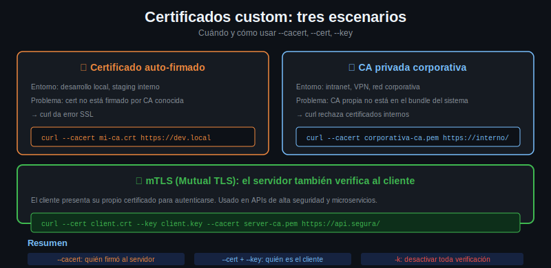

# Certificados custom: escenarios del mundo real



## Los tres escenarios más comunes

### 1. Certificado auto-firmado en desarrollo

El equipo de backend levantó el servidor localmente con HTTPS usando un certificado que ellos mismos generaron. No está firmado por Let's Encrypt ni por ninguna CA conocida.

```bash
# Sin --cacert, curl falla
curl https://localhost:8443/api
# curl: (60) SSL certificate problem: self-signed certificate

# Con --insecure, funciona pero sin validación
curl -k https://localhost:8443/api

# Con --cacert, funciona Y valida (más correcto)
curl --cacert /path/al/server-cert.pem https://localhost:8443/api
```

### 2. CA privada corporativa

La empresa tiene su propia CA interna que firma los certificados de todos sus servidores. El sistema operativo no conoce esa CA, así que curl falla.

```bash
# El equipo de seguridad provee el CA bundle corporativo
curl --cacert /etc/ssl/empresa/ca-bundle.pem https://api-interna.empresa.com

# También se puede setear la variable de entorno (más cómodo para scripts)
export CURL_CA_BUNDLE=/etc/ssl/empresa/ca-bundle.pem
curl https://api-interna.empresa.com
```

### 3. mTLS: el servidor también verifica al cliente

Algunas APIs de alta seguridad requieren que el cliente presente su propio certificado. Esto se llama mutual TLS o mTLS.

```bash
curl --cert cliente.pem --key cliente-key.pem \
     https://api-alta-seguridad.empresa.com/endpoint
```

Si el certificado del cliente y la clave están en un archivo PKCS#12:

```bash
curl --cert cliente.p12:mi-contraseña \
     --cert-type P12 \
     https://api-alta-seguridad.empresa.com/endpoint
```

---

## Generar un certificado auto-firmado con openssl

Para practicar o para un servidor de desarrollo:

```bash
# Generar clave privada y cert auto-firmado en un comando
openssl req -x509 -newkey rsa:4096 -keyout server-key.pem -out server-cert.pem \
    -days 365 -nodes \
    -subj "/C=AR/ST=Buenos Aires/L=CABA/O=Mi Empresa/CN=localhost"

# Resultado: dos archivos
# server-cert.pem  → el certificado (lo comparte con los clientes)
# server-key.pem   → la clave privada (nunca se comparte)
```

Para conectarse a ese servidor desde curl:

```bash
curl --cacert server-cert.pem https://localhost:8443/api
```

---

## Servir HTTPS con Python para practicar

Python 3.11+ incluye `ssl` para servir HTTPS de forma simple:

```bash
# Generar cert primero (comando de arriba)

# Levantar servidor HTTPS en el puerto 4443
python3 -c "
import http.server, ssl
server = http.server.HTTPServer(('localhost', 4443), http.server.SimpleHTTPRequestHandler)
ctx = ssl.SSLContext(ssl.PROTOCOL_TLS_SERVER)
ctx.load_cert_chain('server-cert.pem', 'server-key.pem')
server.socket = ctx.wrap_socket(server.socket, server_side=True)
print('Servidor HTTPS en https://localhost:4443')
server.serve_forever()
"

# En otra terminal, conectarse con el cert como CA
curl --cacert server-cert.pem https://localhost:4443/
```

---

## Diferencia entre --cacert y --cert

Es fácil confundirlos:

| Flag | Qué es | Para qué sirve |
|------|--------|----------------|
| `--cacert archivo.pem` | El certificado de la CA que firmó el servidor | Validar la identidad del servidor |
| `--cert archivo.pem` | Tu propio certificado de cliente | Que el servidor te identifique a vos |
| `--key archivo.pem` | Tu clave privada (va con `--cert`) | Firmar para probar que sos dueño del cert |

---

## Verificar el certificado de un servidor con openssl

Antes de configurar curl, podés inspeccionar el cert directamente:

```bash
# Ver el certificado completo
echo | openssl s_client -connect httpbin.org:443 -servername httpbin.org 2>/dev/null \
    | openssl x509 -noout -text | head -30

# Ver fechas de validez
echo | openssl s_client -connect httpbin.org:443 2>/dev/null \
    | openssl x509 -noout -dates

# Ver quién lo firmó
echo | openssl s_client -connect httpbin.org:443 2>/dev/null \
    | openssl x509 -noout -issuer -subject

# Guardar el certificado del servidor (útil para usar como --cacert después)
echo | openssl s_client -connect localhost:8443 2>/dev/null \
    | openssl x509 > servidor.pem
```

---

## Flujo completo con CA privada

```bash
# 1. Generar CA privada
openssl genrsa -out ca-key.pem 4096
openssl req -new -x509 -days 3650 -key ca-key.pem -out ca-cert.pem \
    -subj "/CN=Mi CA Privada"

# 2. Generar certificado de servidor firmado por esa CA
openssl genrsa -out server-key.pem 2048
openssl req -new -key server-key.pem -out server-csr.pem \
    -subj "/CN=localhost"
openssl x509 -req -days 365 -in server-csr.pem \
    -CA ca-cert.pem -CAkey ca-key.pem -CAcreateserial \
    -out server-cert.pem

# 3. curl usa la CA para validar el server cert
curl --cacert ca-cert.pem https://localhost:8443/
```
