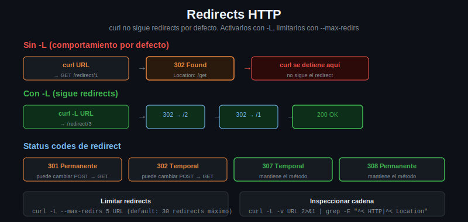

# Redirects: controlar el seguimiento de redirecciones



## Por qué existen los redirects

Los redirects HTTP son respuestas con status codes 3xx que le indican al cliente que el recurso está en otra URL. Los usos más comunes:

- **HTTP → HTTPS**: el servidor redirige todo el tráfico no cifrado a HTTPS
- **URLs antiguas**: cuando se reestructura un sitio, las URLs viejas redirigen a las nuevas
- **Trailing slash**: `/usuarios` redirige a `/usuarios/` (o al revés)
- **Autenticación**: el login exitoso redirige al dashboard
- **URLs cortas**: `bit.ly/xyz` redirige a la URL real

---

## curl NO sigue redirects por defecto

Si el servidor responde con un 301, 302, 307 u 308, curl muestra esa respuesta sin seguir el redirect:

```bash
curl https://httpbin.org/redirect/1
```

Output:

```html
<!DOCTYPE HTML PUBLIC ...>
<title>Redirecting...</title>
<h1>Redirecting...</h1>
<p>You should be redirected automatically to target URL:
<a href="/get">/get</a>
```

curl devuelve el body del 302 pero no va a `/get`.

---

## -L para seguir redirects

El flag `-L` (location) hace que curl siga automáticamente todos los redirects hasta llegar a la respuesta final:

```bash
# Sin -L: muestra el 302
curl https://httpbin.org/redirect/1

# Con -L: sigue el redirect y muestra la respuesta final
curl -L https://httpbin.org/redirect/1

# Flujo de 3 redirects encadenados
curl -L https://httpbin.org/redirect/3
```

---

## --max-redirs: limitar la cadena

Por defecto curl sigue hasta 30 redirects. Para cambiar ese límite:

```bash
# Solo seguir hasta 3 redirects; si hay más, error
curl -L --max-redirs 3 https://httpbin.org/redirect/5
# curl: (47) Maximum (3) redirects followed

# Seguir redirects infinitamente (cuidado con loops)
curl -L --max-redirs -1 https://httpbin.org/redirect/10
```

Para detectar loops de redirects es recomendable siempre poner un límite razonable (5-10).

---

## Ver la cadena completa con -v

`-v` muestra cada request y respuesta, incluyendo los redirects intermedios:

```bash
curl -v -L https://httpbin.org/redirect/2 2>&1 | grep -E "^[<>*]"
```

Verás algo así:

```
> GET /redirect/2 HTTP/2
< HTTP/2 302
< location: /redirect/1
> GET /redirect/1 HTTP/2
< HTTP/2 302
< location: /get
> GET /get HTTP/2
< HTTP/2 200
```

Para ver solo los status codes y los Location headers:

```bash
curl -v -L https://httpbin.org/redirect/3 2>&1 | grep -E "^< HTTP|^< [Ll]ocation"
```

---

## Status codes de redirect y su semántica

| Código | Nombre | Qué hace con el método |
|--------|--------|----------------------|
| 301 | Moved Permanently | Puede cambiar POST a GET (depende del cliente) |
| 302 | Found | Puede cambiar POST a GET (depende del cliente) |
| 303 | See Other | Siempre cambia a GET |
| 307 | Temporary Redirect | Mantiene el método original |
| 308 | Permanent Redirect | Mantiene el método original |

---

## Mantener el método en redirects

Por defecto, si curl sigue un redirect de un POST, puede cambiar a GET (comportamiento heredado de browsers). Para forzar que mantenga POST:

```bash
# El redirect conservará el método POST
curl -L --post301 --post302 \
     -d "campo=valor" \
     https://httpbin.org/redirect-to?url=https://httpbin.org/post
```

Para 307 y 308, curl mantiene el método automáticamente sin flags adicionales.

---

## --location-trusted: pasar credenciales en cross-domain redirects

Si usás `-u usuario:contraseña` o `-H "Authorization: Bearer token"` y hay un redirect a un dominio diferente, curl descarta las credenciales por seguridad. `--location-trusted` las reenvía igual:

```bash
# Las credenciales se reenvían incluso si el redirect va a otro dominio
curl -L --location-trusted -u admin:secreto \
     https://api.dominio-a.com/endpoint
```

Usar con cuidado: si el redirect va a un dominio no confiable, estarías enviando credenciales a un tercero.

---

## Redirect más común en práctica: HTTP → HTTPS

```bash
# http://httpbin.org redirige a https://httpbin.org
# Sin -L solo ves el 301
curl http://httpbin.org/get

# Con -L seguís el redirect automáticamente
curl -L http://httpbin.org/get
```

---

## Resumen

| Flag | Función |
|------|---------|
| `-L` | Seguir redirects automáticamente |
| `--max-redirs N` | Limitar a N redirects máximo |
| `--post301` / `--post302` | Mantener POST en redirects 301/302 |
| `--location-trusted` | Reenviar credenciales en cross-domain redirects |
| `-v` | Ver cada redirect en la cadena |
