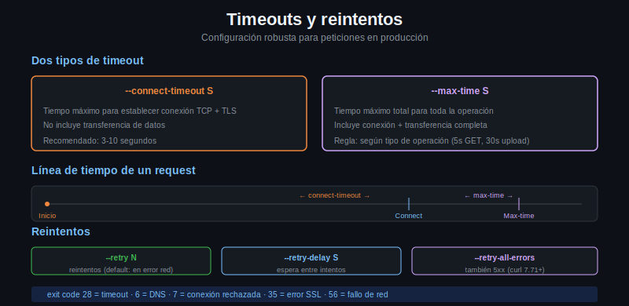

# Timeouts y reintentos: configuración para producción



## Los dos tipos de timeout en curl

curl distingue entre dos momentos distintos en el ciclo de vida de una request:

### 1. --connect-timeout: establecer la conexión

El tiempo máximo que curl espera para completar la conexión TCP (y el handshake TLS para HTTPS). Si el servidor no responde en ese tiempo, curl falla sin esperar más.

```bash
# Fallar si la conexión no se establece en 5 segundos
curl --connect-timeout 5 https://httpbin.org/get

# Detectar servidores caídos rápidamente
curl --connect-timeout 3 https://servidor-que-no-existe.ejemplo.com
# curl: (28) Failed to connect to servidor-que-no-existe.ejemplo.com port 443 after 3001ms
```

Valores típicos: 3-10 segundos para APIs internas, 5-15 para servicios externos.

### 2. --max-time: tiempo total del request

El tiempo máximo para **todo**: conexión + espera de respuesta del servidor + transferencia completa del body. Si cualquier parte demora más que este límite, curl aborta.

```bash
# El request completo no puede durar más de 30 segundos
curl --max-time 30 https://httpbin.org/get

# Forzar timeout en un endpoint lento
# httpbin /delay/10 demora 10 segundos antes de responder
curl --max-time 3 https://httpbin.org/delay/10
# curl: (28) Operation timed out after 3001 milliseconds with 0 bytes received
```

**Regla**: `--max-time` debe ser mayor que `--connect-timeout`. Si `--connect-timeout 5` y `--max-time 3`, el timeout total nunca deja que la conexión se complete.

### Usar ambos juntos

```bash
curl --connect-timeout 5 --max-time 30 https://httpbin.org/get
```

---

## --retry: reintentar en caso de fallo

`--retry N` le dice a curl que reintente el request hasta N veces si falla por errores transitorios. Los errores que activan retry:

- Timeout (`--max-time` superado)
- Error de conexión (servidor caído, red inestable)
- Error de resolución DNS

```bash
# Reintentar hasta 3 veces
curl --retry 3 https://httpbin.org/get

# Reintentar con pausa entre intentos
curl --retry 3 --retry-delay 5 https://httpbin.org/get

# Tiempo total máximo para todos los reintentos
curl --retry 5 --retry-max-time 60 https://httpbin.org/get
```

Por defecto `--retry` NO reintenta si el servidor responde con 5xx. Para eso:

```bash
# Reintentar también en errores 5xx (curl 7.71+)
curl --retry 3 --retry-all-errors https://httpbin.org/status/500
```

---

## --retry-delay vs --retry-max-time

Son dos mecanismos distintos:

- `--retry-delay N`: pausa fija de N segundos entre cada reintento
- `--retry-max-time N`: tiempo total máximo dedicado a todos los reintentos combinados

```bash
# 5 reintentos, esperando 10s entre cada uno
# Tiempo total máximo: 5 * (tiempo_request + 10s) pero no más de 120s
curl --retry 5 --retry-delay 10 --retry-max-time 120 https://httpbin.org/get
```

---

## Backoff exponencial manual en bash

curl no implementa backoff exponencial nativo. En scripts de producción se suele implementar manualmente:

```bash
#!/bin/bash
URL="https://httpbin.org/get"
MAX_INTENTOS=5
ESPERA=2

for intento in $(seq 1 $MAX_INTENTOS); do
    echo "Intento ${intento}/${MAX_INTENTOS}..."
    
    HTTP_CODE=$(curl -s -o /dev/null -w "%{http_code}" \
        --connect-timeout 5 --max-time 15 "$URL")
    
    if [ "$HTTP_CODE" -ge 200 ] && [ "$HTTP_CODE" -lt 300 ]; then
        echo "Exito (HTTP $HTTP_CODE)"
        break
    fi
    
    echo "Fallo (HTTP $HTTP_CODE). Esperando ${ESPERA}s..."
    sleep "$ESPERA"
    ESPERA=$((ESPERA * 2))  # Duplicar el tiempo de espera
done
```

---

## Configuración recomendada por escenario

**API interna (misma red, respuesta rápida):**

```bash
curl --connect-timeout 3 --max-time 10 https://api-interna.empresa.com/endpoint
```

**API externa (internet, puede ser lenta):**

```bash
curl --connect-timeout 10 --max-time 60 --retry 3 --retry-delay 5 \
     https://api-externa.com/endpoint
```

**Descarga de archivo grande:**

```bash
curl --connect-timeout 10 --max-time 600 --retry 3 \
     -o archivo.bin https://descargas.ejemplo.com/archivo-grande.bin
```

**Webhook o request fire-and-forget:**

```bash
curl --connect-timeout 5 --max-time 5 -s -o /dev/null \
     -X POST -d '{"evento": "click"}' \
     https://analytics.ejemplo.com/track
```

---

## Resumen

| Flag | Función |
|------|---------|
| `--connect-timeout N` | Tiempo máximo para establecer la conexión (segundos) |
| `--max-time N` | Tiempo máximo total del request (segundos) |
| `--retry N` | Número de reintentos en caso de fallo de red/timeout |
| `--retry-delay N` | Segundos de pausa entre reintentos |
| `--retry-max-time N` | Tiempo total máximo para todos los reintentos |
| `--retry-all-errors` | Reintentar también en errores 5xx del servidor |
