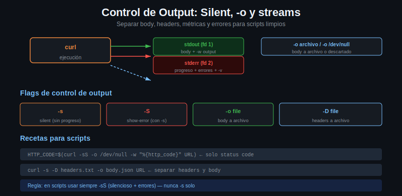

# Control de Output: Silent, -o y separacion de streams



## El problema del output por defecto

Cuando ejecutas curl en una terminal interactiva, muestra una barra de progreso
en stderr y el body de la respuesta en stdout. Esto es util para uso manual, pero
en scripts genera ruido que interfiere con el procesamiento del output.

```bash
# Esto muestra barra de progreso + body mezclados
curl https://httpbin.org/get
```

## El flag -s (--silent)

`-s` suprime completamente el progreso y los mensajes de error de curl. El body
sigue apareciendo en stdout.

```bash
# Solo el body, sin barra de progreso
curl -s https://httpbin.org/get
```

## El flag -S (--show-error) combinado con -s

El problema de `-s` es que tambien suprime los mensajes de error de curl. Si el
servidor no responde, el script falla en silencio. La combinacion `-sS` soluciona
esto: silencia el progreso pero muestra errores de red.

```bash
# Silencioso pero muestra errores de conexion
curl -sS https://httpbin.org/get

# Si el host no existe, veremos:
# curl: (6) Could not resolve host: hostnoinexistente.xyz
curl -sS https://hostnoinexistente.xyz/
```

En scripts, siempre usa `-sS` en lugar de solo `-s`.

## Descartar el body con -o /dev/null

Cuando solo te importan las metricas o el codigo de estado, descartar el body
evita que aparezca en la terminal o se mezcle con el output del script:

```bash
# Solo el codigo HTTP, sin body
curl -s -o /dev/null -w "%{http_code}\n" https://httpbin.org/get
```

`/dev/null` es el "agujero negro" de Unix: todo lo que se escribe ahi desaparece.

## Separar headers de body: -D y -o

A veces necesitas tanto los headers como el body, pero en archivos separados para
procesarlos de forma independiente:

```bash
curl -s -D headers.txt -o body.json https://httpbin.org/get
```

`-D headers.txt` guarda los headers de respuesta (incluyendo la linea de status)
en el archivo indicado. `-o body.json` guarda el body.

Ahora puedes procesar cada uno:

```bash
# Extraer el codigo de status de los headers guardados
grep "HTTP/" headers.txt

# Procesar el JSON del body
cat body.json | python3 -m json.tool
```

## La combinacion clasica para scripts

La combinacion mas comun en scripting es extraer solo el codigo de estado:

```bash
HTTP_CODE=$(curl -s -o /dev/null -w "%{http_code}" https://httpbin.org/status/404)
echo "Codigo recibido: $HTTP_CODE"
```

Para verificar disponibilidad de un servicio en un healthcheck:

```bash
check_url() {
    local url="$1"
    local code
    code=$(curl -sS -o /dev/null -w "%{http_code}" --connect-timeout 5 "$url")
    echo "$url -> $code"
}

check_url "https://httpbin.org/get"
check_url "https://httpbin.org/status/503"
```

## Escribir en stderr vs stdout

En bash, stdout (file descriptor 1) es para datos y stderr (file descriptor 2) es
para mensajes de estado, logs y errores. Separar los streams permite que scripts
componibles funcionen correctamente en pipelines.

```bash
# El body va a stdout (para pipes), las metricas van a stderr (para logs)
curl -s -w "%{stderr}[metrics] code=%{http_code} time=%{time_total}s\n" \
  https://httpbin.org/get | jq '.origin'
```

## Procesar output con pipes

El output de curl puede pasarse directamente a herramientas de procesamiento:

```bash
# Pasar JSON a jq
curl -s https://httpbin.org/get | jq '.headers'

# Buscar texto en el body
curl -s https://httpbin.org/get | grep -i "user-agent"

# Parsear con python3
curl -s https://httpbin.org/get | python3 -c "
import json, sys
data = json.load(sys.stdin)
print('Origin IP:', data['origin'])
"
```

## Resumen de flags de output

| Flag | Efecto |
|------|--------|
| `-s` | Suprime progreso y errores de curl |
| `-S` | Muestra errores (solo util junto con -s) |
| `-o archivo` | Guarda body en archivo en lugar de stdout |
| `-o /dev/null` | Descarta el body |
| `-D archivo` | Guarda headers de respuesta en archivo |
| `-w "formato"` | Imprime variables de la transferencia |
| `2>/dev/null` | Redirige stderr de curl al agujero negro (shell, no flag de curl) |
