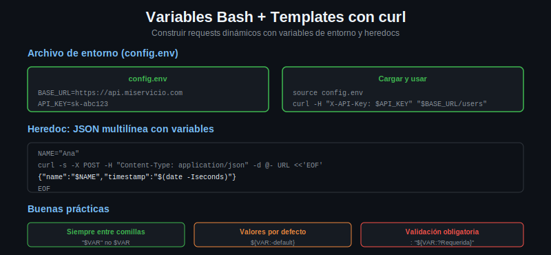

# Variables Bash y Templates con curl



## Por que usar variables

Los comandos curl para uso real raramente tienen la URL y todos los parametros
hardcodeados. Las variables bash permiten:

- Cambiar el entorno (dev/staging/prod) sin tocar el comando
- Reutilizar valores (token, base URL) en multiples requests
- Leer configuracion desde archivos o variables de entorno del sistema

## Variables basicas de entorno

```bash
# Definir variables de configuracion
BASE_URL="https://jsonplaceholder.typicode.com"
TOKEN="eyJhbGciOiJIUzI1NiJ9.ejemplo"
USER_ID=42

# Construir URL dinamicamente
curl -s "$BASE_URL/users/$USER_ID"

# Usar el token en el header
curl -s -H "Authorization: Bearer $TOKEN" "$BASE_URL/posts"
```

Las variables entre comillas dobles se expanden. Siempre pon las variables entre
comillas para evitar problemas con espacios o caracteres especiales.

## Archivo de configuracion de entorno (config.env)

En lugar de exportar variables manualmente, puedes guardarlas en un archivo y
cargarlo con `source` (o el punto `.`):

```bash
# config.env
BASE_URL=https://api.miservicio.com
API_KEY=sk-abc123def456
TIMEOUT=10
ENVIRONMENT=staging
```

```bash
# En el script o en la terminal
source config.env
# o equivalente:
. config.env

curl -sS \
  -H "X-API-Key: $API_KEY" \
  --max-time "$TIMEOUT" \
  "$BASE_URL/users"
```

Agrega `config.env` al `.gitignore` para no commitear credenciales:
```
echo "config.env" >> .gitignore
```

## Heredoc para JSON multi-linea

Cuando el body JSON es complejo, el heredoc permite escribirlo de forma legible
y usar interpolacion de variables bash dentro del JSON:

```bash
NAME="Ana Garcia"
EMAIL="ana@ejemplo.com"
ROLE="admin"

curl -s -X POST \
  -H "Content-Type: application/json" \
  -d @- \
  https://jsonplaceholder.typicode.com/users <<EOF
{
  "name": "$NAME",
  "email": "$EMAIL",
  "role": "$ROLE",
  "metadata": {
    "created_by": "script",
    "timestamp": "$(date -u +%Y-%m-%dT%H:%M:%SZ)"
  }
}
EOF
```

`-d @-` le dice a curl que lea el body de stdin. El heredoc (`<<EOF ... EOF`)
proporciona ese stdin. `$(date ...)` dentro del heredoc se expande normalmente.

## Construir URL con parametros query dinamicos

```bash
BASE_URL="https://jsonplaceholder.typicode.com"
USER_ID=3
START_DATE="2024-01-01"
LIMIT=20

# URL completa
URL="${BASE_URL}/posts?userId=${USER_ID}&_start=0&_limit=${LIMIT}"

curl -s "$URL" | python3 -m json.tool | head -30
```

Para parametros con caracteres especiales que necesitan codificacion URL, usa
`--data-urlencode` con GET (requiere `-G`):

```bash
QUERY="hello world & more"
curl -sG "$BASE_URL/posts" --data-urlencode "title=$QUERY"
```

## Reporte de metricas con --write-out y multiples requests

Un patron muy util es hacer una serie de requests y recolectar metricas de cada
uno para generar un reporte:

```bash
#!/bin/bash

source config.env 2>/dev/null || true

BASE_URL="${BASE_URL:-https://jsonplaceholder.typicode.com}"
FORMAT="%{http_code} %{time_total} %{size_download}"

ENDPOINTS=(
    "/posts/1"
    "/posts/2"
    "/users/1"
    "/comments?postId=1"
    "/todos/1"
)

echo "endpoint                     code  time(s)   size(b)"
echo "----------------------------  ----  --------  -------"

for endpoint in "${ENDPOINTS[@]}"; do
    RESULT=$(curl -sS -o /dev/null -w "$FORMAT" "${BASE_URL}${endpoint}")
    CODE=$(echo "$RESULT" | awk '{print $1}')
    TIME=$(echo "$RESULT" | awk '{print $2}')
    SIZE=$(echo "$RESULT" | awk '{print $3}')
    printf "%-30s  %s    %s  %s\n" "$endpoint" "$CODE" "$TIME" "$SIZE"
done
```

## Buenas practicas con variables

1. **Siempre entre comillas**: `"$VAR"` no `$VAR`. Evita errores con espacios.
2. **Valores por defecto**: `"${VAR:-valor_default}"` funciona aunque VAR no este
   definida.
3. **Readonly para constantes**: `readonly BASE_URL="https://..."` evita sobreescritura
   accidental.
4. **Nombres en mayusculas**: convencion para distinguir variables de entorno
   de variables locales de funciones (que van en minusculas).
5. **Nunca hardcodear secretos**: siempre desde variables de entorno o archivos
   con permisos restringidos.

```bash
# Verificar que las variables requeridas esten definidas
: "${BASE_URL:?La variable BASE_URL es requerida}"
: "${API_KEY:?La variable API_KEY es requerida}"
```

El operador `:?` hace que bash falle con un mensaje claro si la variable no esta
definida o esta vacia, en lugar de hacer el request con datos incorrectos.
