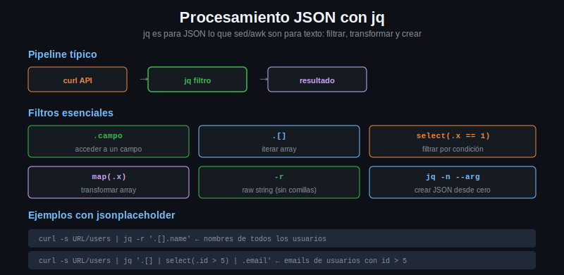

# Procesamiento JSON con jq



## Que es jq

jq es un procesador JSON de linea de comandos. Lee JSON de stdin (o de un archivo),
aplica un filtro y escribe el resultado en stdout. Es para JSON lo que `sed` o `awk`
son para texto plano.

Instalacion:
```bash
# Debian/Ubuntu
sudo apt install jq

# macOS
brew install jq

# Verificar
jq --version
```

## Sintaxis basica

El filtro mas simple es `.` que devuelve el JSON de entrada formateado (pretty-print):

```bash
curl -s https://jsonplaceholder.typicode.com/posts/1 | jq '.'
```

## Acceder a campos

```bash
# Campo de nivel superior
curl -s https://jsonplaceholder.typicode.com/posts/1 | jq '.title'
# Output: "sunt aut facere repellat provident occaecati..."

# Campo anidado
curl -s https://jsonplaceholder.typicode.com/users/1 | jq '.address.city'
# Output: "Gwenborough"

# Campo dentro de objeto dentro de objeto
curl -s https://jsonplaceholder.typicode.com/users/1 | jq '.address.geo.lat'
# Output: "-37.3159"
```

## El flag -r (raw string)

Por defecto, jq envuelve los strings en comillas. Con `-r` los imprime sin comillas,
util para usar el valor en una variable bash:

```bash
TITLE=$(curl -s https://jsonplaceholder.typicode.com/posts/1 | jq -r '.title')
echo "El titulo es: $TITLE"
# El titulo es: sunt aut facere repellat provident occaecati...
```

## Iterar arrays

`.[]` itera sobre todos los elementos de un array:

```bash
# Mostrar todos los posts (cada uno formateado)
curl -s https://jsonplaceholder.typicode.com/posts | jq '.[]'

# Extraer el titulo de cada post
curl -s https://jsonplaceholder.typicode.com/posts | jq -r '.[].title'

# Acceder por indice
curl -s https://jsonplaceholder.typicode.com/posts | jq '.[0]'   # primer elemento
curl -s https://jsonplaceholder.typicode.com/posts | jq '.[-1]'  # ultimo elemento
curl -s https://jsonplaceholder.typicode.com/posts | jq '.[0:3]' # primeros 3
```

## Filtros: select() y map()

`select()` filtra elementos segun una condicion booleana:

```bash
# Posts del usuario con id 1
curl -s https://jsonplaceholder.typicode.com/posts | \
    jq '.[] | select(.userId == 1)'

# Usuarios cuyo nombre contiene "Leanne"
curl -s https://jsonplaceholder.typicode.com/users | \
    jq '.[] | select(.name | contains("Leanne"))'
```

`map()` aplica un transformacion a cada elemento de un array:

```bash
# Array con solo los titulos de todos los posts
curl -s https://jsonplaceholder.typicode.com/posts | \
    jq '[.[] | .title]'

# Forma equivalente con map()
curl -s https://jsonplaceholder.typicode.com/posts | \
    jq 'map(.title)'
```

## El flag -c (compact)

Produce JSON en una sola linea (sin espacios ni saltos de linea). Util para pasar
JSON entre scripts o guardarlo en variables:

```bash
# JSON compacto, una linea
curl -s https://jsonplaceholder.typicode.com/posts/1 | jq -c '.'
```

## Combinar curl + jq en pipelines

```bash
# Extraer solo los nombres de todos los usuarios
curl -s https://jsonplaceholder.typicode.com/users | jq -r '.[].name'

# Contar cuantos posts tiene el usuario 3
curl -s "https://jsonplaceholder.typicode.com/posts?userId=3" | jq 'length'

# Extraer emails de usuarios con id mayor a 5
curl -s https://jsonplaceholder.typicode.com/users | \
    jq -r '.[] | select(.id > 5) | .email'

# Objeto con solo id y nombre de cada usuario
curl -s https://jsonplaceholder.typicode.com/users | \
    jq '[.[] | {id: .id, nombre: .name}]'
```

## Crear JSON con jq -n y --arg

`jq -n` crea JSON desde cero (no lee stdin). `--arg nombre valor` inyecta variables
bash como strings en el filtro:

```bash
NAME="Ana Garcia"
EMAIL="ana@ejemplo.com"
ROLE="admin"

# Crear JSON con valores de variables bash
jq -n --arg name "$NAME" \
      --arg email "$EMAIL" \
      --arg role "$ROLE" \
      '{nombre: $name, email: $email, rol: $role, activo: true}'

# Output:
# {
#   "nombre": "Ana Garcia",
#   "email": "ana@ejemplo.com",
#   "rol": "admin",
#   "activo": true
# }
```

Para numeros o booleanos desde variables bash, usa `--argjson`:

```bash
USER_ID=42
ACTIVO=true

jq -n --arg email "$EMAIL" \
      --argjson id "$USER_ID" \
      --argjson activo "$ACTIVO" \
      '{id: $id, email: $email, activo: $activo}'
```

## Uso en scripts

```bash
#!/bin/bash

# Obtener todos los usuarios y procesarlos
USUARIOS=$(curl -s https://jsonplaceholder.typicode.com/users)

echo "Usuarios registrados:"
echo "$USUARIOS" | jq -r '.[] | "  \(.id). \(.name) <\(.email)>"'

echo ""
echo "Total: $(echo "$USUARIOS" | jq 'length')"

echo ""
echo "Usuarios de la compania Romaguera:"
echo "$USUARIOS" | jq -r '.[] | select(.company.name | contains("Romaguera")) | .name'
```

## Errores comunes

```bash
# MAL: el campo no existe, retorna null no error
jq '.campoQueNoExiste'   # output: null

# Verificar si un campo existe
jq 'if .campo then .campo else "no existe" end'

# MAL: usar comillas dobles dentro del filtro en bash
jq ".[] | select(.name == "Ana")"   # error de syntax bash

# BIEN: comillas simples en bash para el filtro jq
jq '.[] | select(.name == "Ana")'
```
