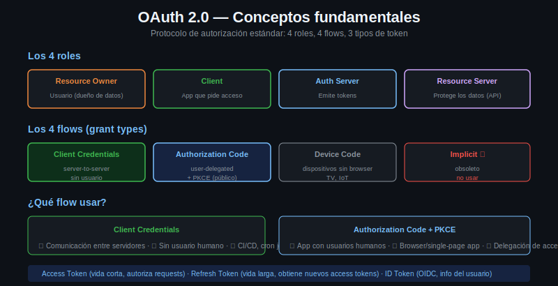

# OAuth2: Conceptos Fundamentales



## Que es OAuth2

OAuth2 (RFC 6749) es un **protocolo de autorización**, no de autenticación. Esta distinción es importante y frecuentemente mal entendida:

- **Autorización**: "esta aplicación tiene permiso para acceder a tus fotos de Google"
- **Autenticación**: "sos vos el que dice ser" — para esto existe OpenID Connect (OIDC), que extiende OAuth2

OAuth2 resuelve un problema concreto: permitir que una aplicación acceda a recursos de un usuario en otro sistema, sin que el usuario le dé su contraseña a esa aplicación.

---

## Los Cuatro Roles

OAuth2 define cuatro actores:

| Rol | Descripcion | Ejemplo |
|-----|-------------|---------|
| **Resource Owner** | El usuario dueno de los datos | La persona que tiene cuenta en GitHub |
| **Client** | La aplicacion que quiere acceder a los datos | Tu script o app |
| **Authorization Server** | Emite los tokens tras verificar identidad y permisos | GitHub OAuth, Auth0, Keycloak |
| **Resource Server** | Tiene los datos protegidos, acepta tokens | GitHub API |

En sistemas simples, Authorization Server y Resource Server pueden ser el mismo. En arquitecturas grandes suelen ser servicios distintos.

---

## Los Cuatro Flujos

### 1. Client Credentials

App a app, sin usuario involucrado. El cliente se autentica directamente con el Authorization Server usando su propio `client_id` y `client_secret`. Ideal para: microservicios, scripts de automatizacion, jobs en background.

### 2. Authorization Code

El flujo principal cuando actuas en nombre de un usuario. El usuario autoriza en el browser, la app recibe un code de un solo uso, lo intercambia por tokens. Con PKCE es el flujo recomendado para apps publicas (mobile, SPA).

### 3. Device Code

Para dispositivos sin browser (smart TV, CLI). El usuario ve un codigo en el dispositivo, lo ingresa en un browser en otro dispositivo. Poco comun en scripting.

### 4. Implicit (deprecated)

Devolvía el token directamente en el redirect. Eliminado en OAuth2.1 por problemas de seguridad. No usarlo.

---

## Los Tres Tipos de Token

### Access Token

- Credencial de corta duración para acceder al Resource Server
- Tipicamente expira en 1 hora o menos
- Puede ser opaco (string random) o estructurado (JWT)
- Se envia en cada request como `Authorization: Bearer TOKEN`

### Refresh Token

- Credencial de larga duración para obtener nuevos access tokens
- Expira en días, semanas o meses
- Solo se usa con el Authorization Server, nunca con el Resource Server
- Si se compromete, permite acceso prolongado — guardar con cuidado

### ID Token (OpenID Connect)

- Especifico de OIDC, no parte del OAuth2 base
- JWT que contiene identidad del usuario (nombre, email, etc.)
- Para autenticar al usuario en el cliente, no para acceder APIs

---

## Que Flujo Usar

```
¿Hay un usuario involucrado?
├── No → Client Credentials
└── Sí → ¿La app puede guardar un client_secret de forma segura?
          ├── Sí (server-side) → Authorization Code
          └── No (mobile, SPA, CLI) → Authorization Code + PKCE
```

Para la mayoría de scripts de automatizacion y herramientas CLI que se ejecutan en un servidor o en tu maquina personal con credenciales configuradas: **Client Credentials**.

---

## Scopes

Los scopes definen qué puede hacer el access token. El cliente solicita scopes al pedir autorización; el Authorization Server los otorga (todos o un subconjunto).

```
scope=read:repos write:issues
```

Principio de minimo privilegio: pedir solo los scopes necesarios para la tarea.

---

## El Token Endpoint

Todos los flujos que involucran obtener un token hacen un `POST` a la URL del token endpoint:

```bash
curl -s -X POST https://auth.ejemplo.com/oauth/token \
  -H "Content-Type: application/x-www-form-urlencoded" \
  -d "grant_type=client_credentials" \
  -d "client_id=mi-app" \
  -d "client_secret=mi-secreto" \
  -d "scope=api:read"
```

La respuesta es siempre JSON:

```json
{
  "access_token": "eyJhbGciOiJSUzI1NiJ9...",
  "token_type": "Bearer",
  "expires_in": 3600,
  "scope": "api:read"
}
```
