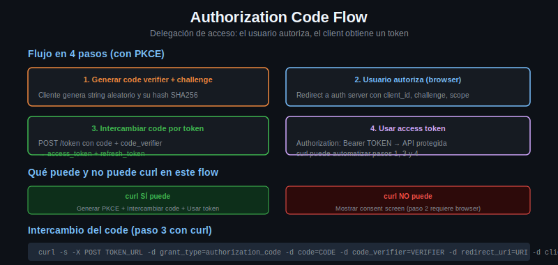

# Authorization Code Flow



## Cuando Usar Este Flujo

Client Credentials es suficiente cuando la aplicacion actua con su propia identidad. Authorization Code se usa cuando la aplicacion necesita actuar **en nombre de un usuario**: leer sus emails, publicar en sus redes sociales, acceder a su almacenamiento en la nube.

El usuario debe poder ver exactamente a que da acceso y decidir si autoriza o no.

---

## El Flujo Completo

```
Usuario    Client (tu app)         Auth Server         Resource Server
  |              |                      |                    |
  |-- click ---->|                      |                    |
  |              |-- redirigir -------->|                    |
  |              |   (URL de auth)      |                    |
  |<---- browser abre login ----------|                    |
  |-- login + autoriza -------------->|                    |
  |              |<-- redirect con code-|                    |
  |              |-- POST /token ------>|                    |
  |              |   (code, secret)     |-- valida code ---->|
  |              |<-- access_token -----|                    |
  |              |-- GET /recurso ----->|----GET /recurso--->|
  |              |<-- datos ------------|<---datos ----------|
```

---

## Paso 1: La URL de Autorizacion

El cliente construye una URL para que el usuario la abra en el browser. curl puede ayudarte a construirla o verificarla, pero es el **browser** quien la abre:

```bash
AUTH_SERVER="https://accounts.google.com"
CLIENT_ID="tu-client-id"
REDIRECT_URI="http://localhost:8080/callback"
SCOPE="email profile"
STATE=$(openssl rand -hex 16)  # CSRF protection

# Construir la URL (curl -G puede codificar query params)
curl -G --output /dev/null --write-out "%{url_effective}\n" \
  "$AUTH_SERVER/o/oauth2/v2/auth" \
  --data-urlencode "client_id=$CLIENT_ID" \
  --data-urlencode "redirect_uri=$REDIRECT_URI" \
  --data-urlencode "response_type=code" \
  --data-urlencode "scope=$SCOPE" \
  --data-urlencode "state=$STATE"
```

El usuario abre esa URL, hace login y autoriza. El browser lo redirige a:
```
http://localhost:8080/callback?code=4/P7q7W91&state=abc123
```

---

## Paso 2: El Usuario Autoriza (no automatizable)

Este paso ocurre en el browser del usuario. curl no puede automatizarlo en flujos reales porque:
- Requiere que el usuario vea una pagina con informacion de la app y los permisos
- Requiere login con contraseña del usuario
- El consentimiento debe ser explícito

En scripts de desarrollo/testing se puede omitir si el servidor OAuth2 tiene un endpoint de login programatico (como Keycloak en modo dev).

---

## Paso 3: Intercambiar el Code por Tokens

Este paso sí se hace con curl. El `code` recibido en el callback se intercambia por tokens:

```bash
CODE="4/P7q7W91a..."
CLIENT_SECRET="tu-client-secret"

TOKEN_RESPONSE=$(curl -s -X POST "https://oauth2.googleapis.com/token" \
  -H "Content-Type: application/x-www-form-urlencoded" \
  -d "grant_type=authorization_code" \
  -d "code=$CODE" \
  -d "client_id=$CLIENT_ID" \
  -d "client_secret=$CLIENT_SECRET" \
  -d "redirect_uri=$REDIRECT_URI")

echo "$TOKEN_RESPONSE" | jq '.'
```

Respuesta:
```json
{
  "access_token": "ya29.a0AfH...",
  "expires_in": 3599,
  "refresh_token": "1//0gLd...",
  "scope": "email profile",
  "token_type": "Bearer",
  "id_token": "eyJhbGci..."
}
```

El `code` es de **un solo uso** y expira rapido (tipicamente 10 minutos). Si lo gastas, necesitas empezar el flujo desde cero.

---

## Paso 4: Usar el Access Token

Identico a Client Credentials:

```bash
ACCESS_TOKEN=$(echo "$TOKEN_RESPONSE" | jq -r '.access_token')

curl -s "https://www.googleapis.com/oauth2/v2/userinfo" \
  -H "Authorization: Bearer $ACCESS_TOKEN"
```

---

## PKCE: Para Apps Sin Client Secret

PKCE (Proof Key for Code Exchange, pronunciado "pixie") resuelve el problema de apps publicas que no pueden guardar un `client_secret` de forma segura (apps mobile, SPA, herramientas CLI distribuidas).

```bash
# Generar code_verifier (string random, 43-128 chars)
CODE_VERIFIER=$(openssl rand -base64 64 | tr -d '=+/' | head -c 128)

# Calcular code_challenge = BASE64URL(SHA256(code_verifier))
CODE_CHALLENGE=$(echo -n "$CODE_VERIFIER" | \
  openssl dgst -sha256 -binary | \
  base64 | tr '+/' '-_' | tr -d '=')

# Agregar a la URL de autorizacion
# code_challenge=$CODE_CHALLENGE
# code_challenge_method=S256

# Al intercambiar el code, enviar code_verifier en lugar de client_secret
curl -s -X POST "$TOKEN_ENDPOINT" \
  -d "grant_type=authorization_code" \
  -d "code=$CODE" \
  -d "redirect_uri=$REDIRECT_URI" \
  -d "client_id=$CLIENT_ID" \
  -d "code_verifier=$CODE_VERIFIER"
```

El servidor verifica que `SHA256(code_verifier) == code_challenge` del paso de autorizacion.

---

## Que Puede Hacer curl en Este Flujo

| Paso | curl lo puede hacer | Requiere browser |
|------|--------------------|--------------------|
| Construir URL de autorizacion | Si (solo construir) | Si (para abrirla) |
| Login del usuario | No | Si |
| Consentimiento del usuario | No | Si |
| Intercambiar code por tokens | Si | No |
| Usar el access token | Si | No |
| Renovar con refresh token | Si | No |

Para flujos completamente automatizados, usar Client Credentials. Authorization Code con curl solo es util cuando ya tenés el `code` (por ejemplo, en scripts que manejan el callback de un servidor local).
