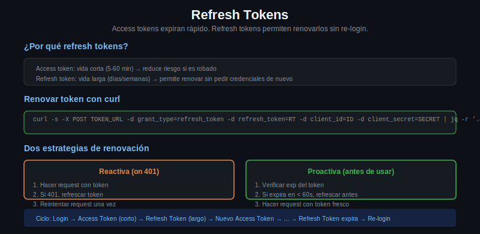

# Refresh Tokens



## Por Que Expiran los Access Tokens

Los access tokens tienen vida corta intencionalmente. Si un access token se filtra (en un log, en trafico interceptado, en un error de codigo), el dano es limitado: el atacante solo puede usarlo hasta que expire.

Tiempos tipicos:
- Access token: 1 hora (comun), 15 minutos (conservador), 24 horas (laxo)
- Refresh token: 1 dia, 7 dias, 30 dias, o hasta que el usuario revoque

---

## Que es el Refresh Token

El refresh token es una credencial de larga duracion que permite obtener nuevos access tokens sin que el usuario vuelva a autorizar. Es la forma de mantener una sesion larga sin pedirle al usuario que haga login repetidamente.

**Donde guardarlo**: en un archivo seguro con permisos 600, nunca en codigo fuente, nunca en variables de entorno de CI publico.

---

## El Request de Renovacion

```bash
REFRESH_TOKEN="1//0gLd-refreshtoken..."
CLIENT_ID="tu-client-id"
CLIENT_SECRET="tu-client-secret"
TOKEN_ENDPOINT="https://oauth2.googleapis.com/token"

NEW_TOKEN_RESPONSE=$(curl -s -X POST "$TOKEN_ENDPOINT" \
  -H "Content-Type: application/x-www-form-urlencoded" \
  -d "grant_type=refresh_token" \
  -d "refresh_token=$REFRESH_TOKEN" \
  -d "client_id=$CLIENT_ID" \
  -d "client_secret=$CLIENT_SECRET")

echo "$NEW_TOKEN_RESPONSE" | jq '.'
```

Respuesta:
```json
{
  "access_token": "ya29.nuevo-token...",
  "expires_in": 3599,
  "token_type": "Bearer",
  "scope": "api"
}
```

Nota: algunos servidores devuelven un nuevo `refresh_token` en esta respuesta. Si lo hacen, actualizar el guardado — el viejo puede quedar invalido.

---

## Cuándo Renovar

Hay dos estrategias:

### Estrategia 1: Renovar al detectar 401

```bash
api_call() {
  local method="$1"
  local url="$2"
  local data="$3"

  response=$(curl -s -w "\n%{http_code}" -X "$method" "$url" \
    -H "Authorization: Bearer $(get_token)" \
    ${data:+-d "$data"})

  http_code=$(echo "$response" | tail -1)
  body=$(echo "$response" | head -n -1)

  if [ "$http_code" = "401" ]; then
    echo "Token expirado, renovando..." >&2
    refresh_token
    # Reintentar la llamada original
    curl -s -X "$method" "$url" \
      -H "Authorization: Bearer $(get_token)" \
      ${data:+-d "$data"}
  else
    echo "$body"
  fi
}
```

### Estrategia 2: Verificar expiracion antes de cada uso (proactiva)

```bash
is_token_expired() {
  local token_file="$HOME/.myapp/token"
  
  if [ ! -f "$token_file" ]; then
    return 0  # No hay token, considerar expirado
  fi
  
  local exp
  exp=$(jq -r '.expires_at' "$token_file")
  local now
  now=$(date +%s)
  local margin=60  # Renovar 60 segundos antes de la expiracion real
  
  if [ "$(( exp - margin ))" -lt "$now" ]; then
    return 0  # Esta por expirar o ya expiro
  fi
  return 1  # Todavia valido
}

get_valid_token() {
  if is_token_expired; then
    refresh_token
  fi
  jq -r '.access_token' "$HOME/.myapp/token"
}
```

La estrategia proactiva es mas robusta porque evita requests fallidos.

---

## Script Completo: Token Lifecycle

```bash
#!/bin/bash
# token-lifecycle.sh

TOKEN_FILE="$HOME/.myapp/token"
CONFIG_FILE="$HOME/.myapp/config"
TOKEN_ENDPOINT="https://demo.duendesoftware.com/connect/token"

# Cargar configuracion
source "$CONFIG_FILE"

save_token() {
  local response="$1"
  local access_token expires_in refresh_token expires_at

  access_token=$(echo "$response" | jq -r '.access_token')
  expires_in=$(echo "$response" | jq -r '.expires_in')
  refresh_token=$(echo "$response" | jq -r '.refresh_token // empty')
  expires_at=$(( $(date +%s) + expires_in ))

  mkdir -p "$(dirname "$TOKEN_FILE")"
  
  jq -n \
    --arg at "$access_token" \
    --arg rt "$refresh_token" \
    --argjson ea "$expires_at" \
    '{access_token: $at, refresh_token: $rt, expires_at: $ea}' \
    > "$TOKEN_FILE"
  
  chmod 600 "$TOKEN_FILE"
  echo "Token guardado, expira en ${expires_in}s"
}

is_expired() {
  [ ! -f "$TOKEN_FILE" ] && return 0
  local exp now
  exp=$(jq -r '.expires_at' "$TOKEN_FILE")
  now=$(date +%s)
  [ "$(( exp - 60 ))" -lt "$now" ]
}

do_refresh() {
  local rt
  rt=$(jq -r '.refresh_token' "$TOKEN_FILE")
  
  if [ -z "$rt" ] || [ "$rt" = "null" ]; then
    echo "No hay refresh token disponible" >&2
    return 1
  fi

  local response
  response=$(curl -s -X POST "$TOKEN_ENDPOINT" \
    -H "Content-Type: application/x-www-form-urlencoded" \
    -d "grant_type=refresh_token" \
    -d "refresh_token=$rt" \
    -d "client_id=$CLIENT_ID" \
    -d "client_secret=$CLIENT_SECRET")

  if echo "$response" | jq -e '.access_token' > /dev/null 2>&1; then
    save_token "$response"
  else
    echo "Error al renovar token: $response" >&2
    return 1
  fi
}

get_token() {
  if is_expired; then
    do_refresh || return 1
  fi
  jq -r '.access_token' "$TOKEN_FILE"
}
```

---

## Cuando el Refresh Token Tambien Expira

Si el refresh token vence, la unica salida es volver al flujo inicial (Authorization Code o Client Credentials). Esto es intencional: fuerza al usuario a reautorizar periodicamente.

Para detectarlo: el servidor devuelve `invalid_grant` o `invalid_token` al intentar usar el refresh token expirado. El script debe detectar este error y solicitar login nuevamente.
