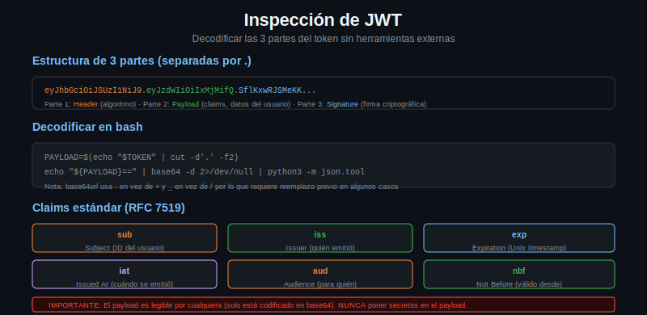

# JWT: Inspeccion y Decodificacion



## Que es un JWT

JWT (JSON Web Token, pronunciado "yot") es un formato de token compacto y autocontenido. Un JWT lleva información dentro de sí mismo, lo que permite al Resource Server verificarlo sin consultar al Authorization Server en cada request.

Estructura: tres partes en base64url separadas por puntos:

```
eyJhbGciOiJSUzI1NiJ9.eyJzdWIiOiJ1c2VyMTIzIiwiZXhwIjoxNzI4MDAwMDAwfQ.firma
^--- header ---^   ^---------- payload ----------^   ^--- signature ---^
```

---

## Las Tres Partes

### Header

Contiene el algoritmo de firma y el tipo de token:

```json
{
  "alg": "RS256",
  "typ": "JWT",
  "kid": "2024-key-1"
}
```

`alg` puede ser:
- `RS256` — RSA con SHA-256 (asimetrico, el mas comun en produccion)
- `HS256` — HMAC con SHA-256 (simetrico, clave compartida)
- `ES256` — ECDSA con SHA-256 (asimetrico, mas compacto)

### Payload

Contiene los "claims" (afirmaciones sobre el sujeto):

```json
{
  "sub": "user123",
  "iss": "https://auth.miapp.com",
  "aud": "mi-api",
  "iat": 1728000000,
  "exp": 1728003600,
  "scope": "api:read api:write",
  "email": "usuario@ejemplo.com"
}
```

Claims estandar (RFC 7519):
- `sub` — subject: identificador del usuario o app
- `iss` — issuer: quien emitio el token
- `aud` — audience: para quien es el token
- `iat` — issued at: cuando se emitio (Unix timestamp)
- `exp` — expiration: cuando expira (Unix timestamp)
- `nbf` — not before: no valido antes de esta fecha

### Signature

Firma criptografica que garantiza que el header y payload no fueron modificados. Solo el Authorization Server puede crear firmas validas.

---

## Decodificar un JWT con Bash

El encoding base64url es como base64 pero con `-` en lugar de `+` y `_` en lugar de `/`, y sin padding `=`.

```bash
JWT="eyJhbGciOiJSUzI1NiJ9.eyJzdWIiOiJ1c2VyMTIzIiwiZXhwIjoxNzI4MDAwMDAwfQ.firma"

# Separar las partes
HEADER=$(echo "$JWT" | cut -d. -f1)
PAYLOAD=$(echo "$JWT" | cut -d. -f2)
SIGNATURE=$(echo "$JWT" | cut -d. -f3)

# Decodificar payload (agregar padding si es necesario)
decode_base64url() {
  local input="$1"
  # Restaurar caracteres de base64 estandar
  local padded="${input//-/+}"
  padded="${padded//_//}"
  # Agregar padding '=' hasta que sea multiplo de 4
  case $(( ${#padded} % 4 )) in
    2) padded="${padded}==" ;;
    3) padded="${padded}=" ;;
  esac
  echo "$padded" | base64 -d 2>/dev/null
}

# Decodificar
echo "=== HEADER ==="
decode_base64url "$HEADER" | jq '.'

echo "=== PAYLOAD ==="
decode_base64url "$PAYLOAD" | jq '.'
```

---

## Verificar Expiracion

```bash
# Extraer el timestamp de expiracion
EXP=$(decode_base64url "$PAYLOAD" | jq -r '.exp')
NOW=$(date +%s)

if [ -z "$EXP" ] || [ "$EXP" = "null" ]; then
  echo "El token no tiene campo 'exp' — no expira"
elif [ "$EXP" -lt "$NOW" ]; then
  echo "El token EXPIRO hace $(( NOW - EXP )) segundos"
else
  echo "El token es valido por $(( EXP - NOW )) segundos mas"
  echo "Expira: $(date -d @$EXP)"
fi
```

---

## Inspeccion Rapida (one-liner)

Para debugging rapido en la terminal:

```bash
# Mostrar payload de cualquier JWT
jwt_payload() {
  echo "$1" | cut -d. -f2 | \
    awk '{l=length($0)%4; if(l>0){pad=substr("====",1,4-l)}; print $0 pad}' | \
    base64 -d 2>/dev/null | jq '.'
}

# Uso
jwt_payload "eyJhbGciOiJSUzI1NiJ9.eyJzdWIiOiJ1c2VyMTIzIn0.xxx"
```

---

## Lo que NO Debes Hacer

### Nunca verificar la firma del lado del cliente sin la clave publica

Decodificar el payload de un JWT es trivial. Pero eso no significa que puedas confiar en los datos que contiene, a menos que hayas verificado la firma.

Para verificar la firma necesitas:
1. La clave publica del Authorization Server (disponible en `/.well-known/jwks.json`)
2. Una libreria de criptografia adecuada

En scripts bash, verificar la firma manualmente es propenso a errores. Para uso en produccion, dejar la verificacion al Resource Server (que ya la hace antes de darte acceso).

### Nunca usar jwt.io con tokens de produccion

jwt.io es una herramienta excelente para aprender, pero es un sitio web externo. Los tokens de produccion pueden contener informacion sensible. Para debugging en desarrollo esta bien; para produccion usar solo la terminal.

---

## Resumen de Comandos Utiles

```bash
# Ver el payload de un JWT
echo "TOKEN" | cut -d. -f2 | base64 -d 2>/dev/null | jq '.'

# Ver cuando expira
echo "TOKEN" | cut -d. -f2 | base64 -d 2>/dev/null | jq -r '.exp' | xargs -I{} date -d @{}

# Verificar si ya expiro
exp=$(echo "TOKEN" | cut -d. -f2 | base64 -d 2>/dev/null | jq -r '.exp')
[ "$exp" -gt "$(date +%s)" ] && echo "valido" || echo "expirado"
```
