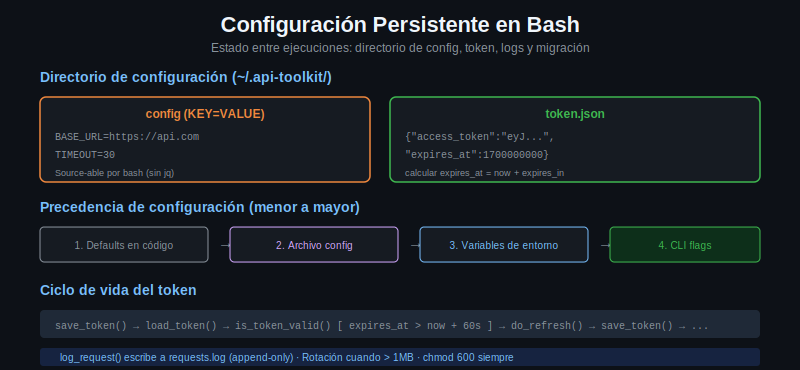

# Configuracion persistente en bash



[← 01: Arquitectura CLI](01-arquitectura-cli.md) | [→ 03: Testing](03-testing-scripts-bash.md)

---

## El problema: estado entre ejecuciones

Un script bash no recuerda nada entre ejecuciones. Cada vez que lo llamas, empieza desde cero. Para una herramienta que el usuario configura una vez y usa muchas veces, necesitas persistir estado en el sistema de archivos.

Ejemplos de estado que necesitas guardar:
- La URL base de la API
- El tipo de autenticacion (bearer, api_key, none)
- El token de acceso actual y su fecha de expiracion
- El historial de requests (para debugging)

---

## El directorio de configuracion del usuario

La convencion en Linux y macOS es guardar la configuracion de herramientas en `~/.toolname/`:

```
~/.api-toolkit/
├── config          # configuracion general (BASE_URL, AUTH_TYPE, etc.)
├── token.json      # token de acceso guardado
└── requests.log    # log de requests realizados
```

Por que `~/.api-toolkit/` y no un archivo suelto como `~/.api-toolkit-config`:
- Es extensible: puedes anadir mas archivos sin contaminar el home del usuario
- Es organizado: todo lo relacionado con la herramienta esta en un solo lugar
- Permite permisos a nivel de directorio (solo el usuario puede leer)

---

## Formatos de configuracion

### Formato KEY=VALUE (recomendado para bash)

```bash
# ~/.api-toolkit/config
BASE_URL=https://api.ejemplo.com
AUTH_TYPE=bearer
CLIENT_ID=mi-client-id
# CLIENT_SECRET se guarda en variable de entorno por seguridad
# API_KEY=
TIMEOUT=30
VERBOSE=0
```

La ventaja de este formato es que puede cargarse directamente con `source`:

```bash
source ~/.api-toolkit/config
echo "$BASE_URL"  # https://api.ejemplo.com
```

Los comentarios (lineas con `#`) son ignorados por bash cuando haces `source`.

### Alternativa: JSON (requiere jq)

```json
{
  "base_url": "https://api.ejemplo.com",
  "auth_type": "bearer",
  "timeout": 30
}
```

Para cargar: `BASE_URL=$(jq -r '.base_url' ~/.api-toolkit/config.json)`. Es mas verboso pero interoperable con otras herramientas.

Para `api-toolkit` usaremos el formato KEY=VALUE por simplicidad.

---

## Jerarquia de precedencia

Una buena CLI respeta esta jerarquia, de menor a mayor prioridad:

```
1. Defaults en el codigo        (mas bajo)
2. Archivo ~/.api-toolkit/config
3. Variables de entorno
4. Flags de CLI                 (mas alto)
```

Ejemplo: si `BASE_URL` esta en el config como `https://api.dev.com`, pero el usuario lo llama con `--base-url https://api.prod.com`, el flag gana.

Implementacion:

```bash
load_config() {
  # 1. Defaults en el codigo
  BASE_URL="${BASE_URL:-https://jsonplaceholder.typicode.com}"
  AUTH_TYPE="${AUTH_TYPE:-none}"
  TIMEOUT="${TIMEOUT:-30}"
  VERBOSE="${VERBOSE:-0}"
  DRY_RUN="${DRY_RUN:-0}"

  # 2. Archivo de config (sobreescribe defaults)
  if [[ -f "${CONFIG_DIR}/config" ]]; then
    source "${CONFIG_DIR}/config"
  fi

  # 3. Variables de entorno ya estan en el ambiente (ya sobreescribieron los defaults)
  # No se necesita hacer nada: source del archivo no pisa variables ya definidas
  # PORQUE usamos la forma: VAR="${VAR:-default}" que solo asigna si VAR no existe

  # ATENCION: el orden importa. Si haces:
  #   source "${CONFIG_DIR}/config"
  #   BASE_URL="${BASE_URL:-default}"
  # El source pisa la variable de entorno. Hay que poner los defaults ANTES del source
  # o usar una logica mas cuidadosa.
}
```

Nota importante sobre el orden: los defaults con `${VAR:-default}` deben ir ANTES del `source` del config file, o el config file pisara las variables de entorno. El config file sobreescribe los defaults del codigo, pero las variables de entorno deben ganar al config file.

Una implementacion mas robusta:

```bash
load_config() {
  # Guardar variables de entorno que el usuario pudo haber seteado
  local env_base_url="${BASE_URL:-}"
  local env_auth_type="${AUTH_TYPE:-}"

  # Defaults
  BASE_URL="https://jsonplaceholder.typicode.com"
  AUTH_TYPE="none"
  TIMEOUT=30
  VERBOSE=0

  # Config file (sobreescribe defaults)
  if [[ -f "${CONFIG_DIR}/config" ]]; then
    source "${CONFIG_DIR}/config"
  fi

  # Variables de entorno (sobreescriben config file)
  [[ -n "$env_base_url" ]]  && BASE_URL="$env_base_url"
  [[ -n "$env_auth_type" ]] && AUTH_TYPE="$env_auth_type"

  # CLI flags se aplican en main() antes de llamar a los comandos
}
```

---

## Inicializar la configuracion

```bash
init_config() {
  # Crear directorio con permisos restrictivos
  mkdir -p "$CONFIG_DIR"
  chmod 700 "$CONFIG_DIR"   # solo el usuario puede leer/escribir/ejecutar

  if [[ -f "${CONFIG_DIR}/config" ]]; then
    read -r -p "Ya existe una config. Sobreescribir? [s/N] " confirm
    [[ "${confirm,,}" != "s" ]] && echo "Cancelado." && return 0
  fi

  # Modo interactivo
  echo "Configuracion de api-toolkit"
  echo "----------------------------"

  read -r -p "BASE_URL [https://jsonplaceholder.typicode.com]: " input_url
  local base_url="${input_url:-https://jsonplaceholder.typicode.com}"

  echo "Tipo de autenticacion:"
  echo "  1) none (sin autenticacion)"
  echo "  2) api_key"
  echo "  3) bearer (OAuth2)"
  echo "  4) basic"
  read -r -p "Seleccionar [1]: " auth_choice

  local auth_type
  case "${auth_choice:-1}" in
    1) auth_type="none" ;;
    2) auth_type="api_key" ;;
    3) auth_type="bearer" ;;
    4) auth_type="basic" ;;
    *) auth_type="none" ;;
  esac

  # Escribir config
  cat > "${CONFIG_DIR}/config" <<EOF
# api-toolkit configuration
# Generado: $(date '+%Y-%m-%d %H:%M:%S')

BASE_URL=${base_url}
AUTH_TYPE=${auth_type}

# Para AUTH_TYPE=api_key:
# API_KEY=tu-api-key-aqui

# Para AUTH_TYPE=bearer:
# TOKEN_URL=https://auth.ejemplo.com/oauth/token
# CLIENT_ID=tu-client-id
# CLIENT_SECRET se recomienda en variable de entorno, no aqui

# Para AUTH_TYPE=basic:
# BASIC_USER=usuario
# BASIC_PASS se recomienda en variable de entorno

TIMEOUT=30
EOF

  chmod 600 "${CONFIG_DIR}/config"   # solo lectura/escritura para el usuario
  echo "Config creada en ${CONFIG_DIR}/config"
  echo "Edita el archivo para completar las credenciales."
}
```

### Permisos correctos

```bash
chmod 700 "$CONFIG_DIR"        # directorio: solo el usuario
chmod 600 "${CONFIG_DIR}/config"  # config: solo el usuario (sin ejecucion)
chmod 600 "${CONFIG_DIR}/token.json"  # tokens: idem
```

Nunca guardes el `CLIENT_SECRET` o `API_KEY` en un archivo con permisos 644 (legible por otros usuarios del sistema). El `chmod 600` lo protege.

---

## Guardar y leer el token

El token de acceso necesita persistir entre llamadas a la herramienta:

```bash
save_token() {
  local access_token="$1"
  local expires_in="${2:-3600}"  # segundos hasta expiracion

  local expires_at
  expires_at=$(( $(date +%s) + expires_in ))

  mkdir -p "$CONFIG_DIR"
  cat > "${CONFIG_DIR}/token.json" <<EOF
{
  "access_token": "${access_token}",
  "expires_at": ${expires_at},
  "saved_at": $(date +%s)
}
EOF
  chmod 600 "${CONFIG_DIR}/token.json"
  info "Token guardado. Expira en ${expires_in}s ($(date -d "@${expires_at}" '+%H:%M:%S' 2>/dev/null || date -r "${expires_at}" '+%H:%M:%S'))"
}

load_token() {
  local token_file="${CONFIG_DIR}/token.json"
  if [[ ! -f "$token_file" ]]; then
    return 1
  fi
  jq -r '.access_token' "$token_file"
}

is_token_valid() {
  local token_file="${CONFIG_DIR}/token.json"
  [[ ! -f "$token_file" ]] && return 1

  local expires_at
  expires_at=$(jq -r '.expires_at' "$token_file")
  local now
  now=$(date +%s)
  local margin=60  # renovar 60 segundos antes de que expire

  (( now < expires_at - margin ))
}
```

---

## Logging de requests

```bash
log_request() {
  local method="$1"
  local endpoint="$2"
  local status_code="$3"
  local duration_ms="$4"

  local log_file="${CONFIG_DIR}/requests.log"
  echo "$(date '+%Y-%m-%d %H:%M:%S') ${method} ${BASE_URL}${endpoint} ${status_code} ${duration_ms}ms" >> "$log_file"
}
```

El log es append-only. Con el tiempo puede crecer: considera rotar si supera un tamano:

```bash
# Rotar log si supera 1MB
if [[ -f "$log_file" ]] && (( $(stat -c%s "$log_file" 2>/dev/null || stat -f%z "$log_file") > 1048576 )); then
  mv "$log_file" "${log_file}.old"
fi
```

---

## Migracion de config entre versiones

Si en el futuro cambias la estructura del config, necesitas migrar los archivos existentes:

```bash
readonly CONFIG_VERSION="2"

migrate_config() {
  local current_version
  current_version=$(grep '^CONFIG_VERSION=' "${CONFIG_DIR}/config" 2>/dev/null | cut -d= -f2 || echo "1")

  if [[ "$current_version" == "$CONFIG_VERSION" ]]; then
    return 0  # ya esta actualizado
  fi

  log "Migrando config de v${current_version} a v${CONFIG_VERSION}..."

  case "$current_version" in
    1)
      # En v1, TIMEOUT no existia; aniadirlo con valor default
      echo "TIMEOUT=30" >> "${CONFIG_DIR}/config"
      echo "CONFIG_VERSION=2" >> "${CONFIG_DIR}/config"
      ;;
  esac

  log "Config migrado correctamente."
}
```

---

## Siguiente

[→ 03: Testing de scripts bash](03-testing-scripts-bash.md) — como verificar que tu herramienta funciona correctamente.
